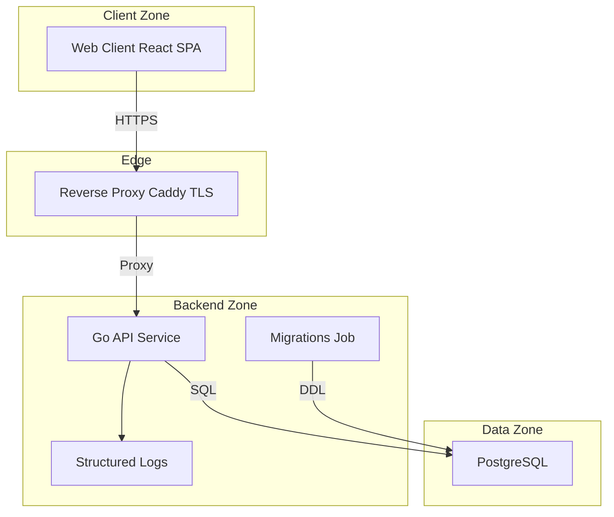
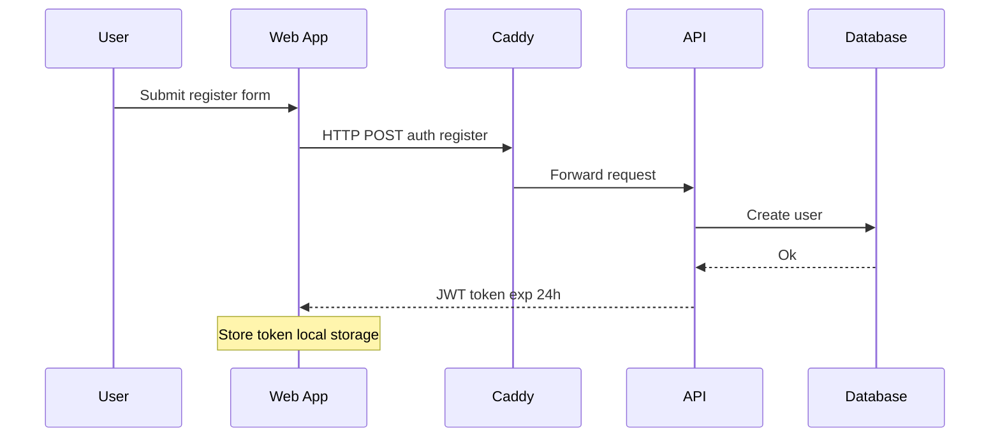
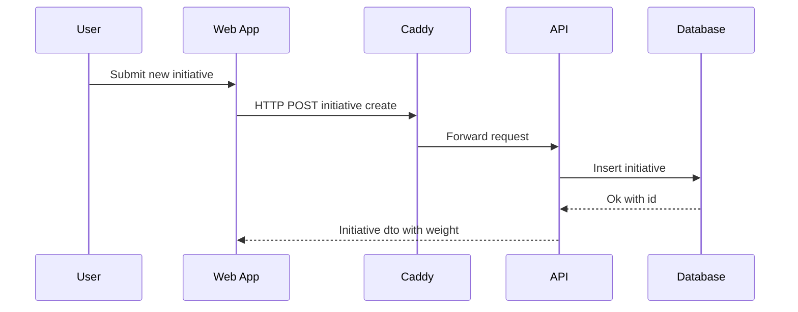
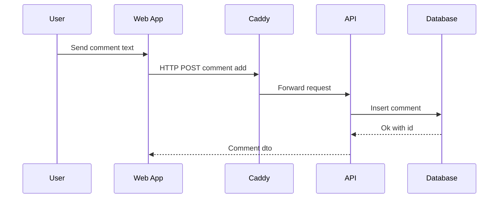
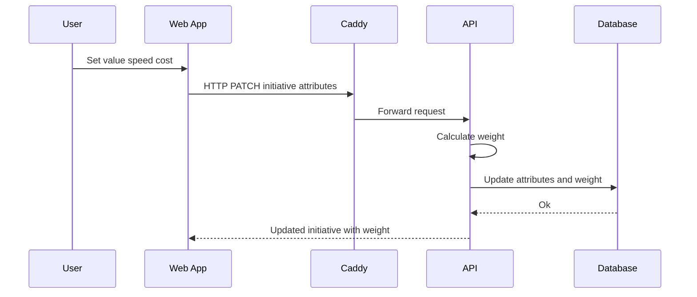
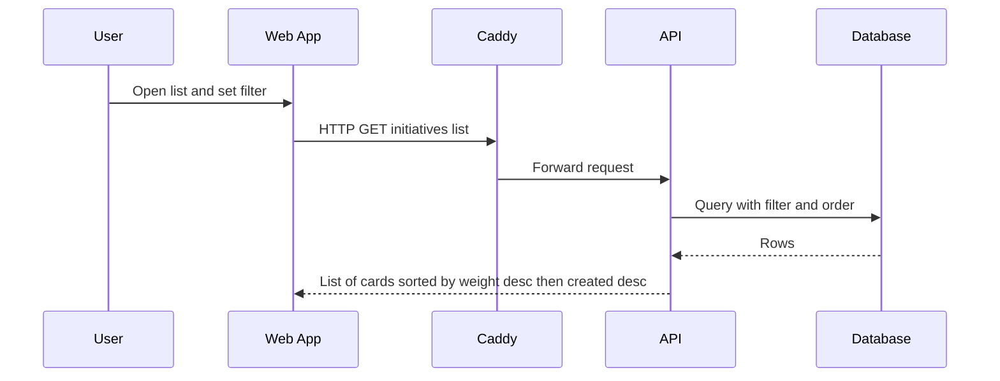

## Архитектура решения IdeaFrame (MVP)

Документ описывает целевую архитектуру MVP системы фрейминга портфеля инициатив. Основан на требованиях из `docs/prd.md`. Детализация достаточна для подготовки логической модели данных (`db/schema.dbml`) и спецификации API (`docs/openapi.yaml`).

---

## Обзор и цели
- Цель: предоставить простой веб‑клиент для создания инициатив, обсуждения в чате, оценки атрибутов и вычисления итогового веса, с авторизацией по JWT.
- Пользователь: одна роль, все операции доступны всем авторизованным пользователям.
- Критерий успеха: за 1–2 минуты пользователь создаёт инициативу, получает вес и делится ссылкой.

## Технологический стек
- Backend: Go
- База данных: PostgreSQL
- Миграции: golang migrate (как отдельная job при запуске)
- Frontend: React (SPA)
- Proxy и TLS: Caddy (обратный прокси, автоматические сертификаты)
- Аутентификация: JWT срок жизни 24 часа
- Оркестрация локально: docker compose

---

## Диаграмма компонентов

Каналы и протоколы:
- Web → Caddy: HTTPS
- Caddy → API: HTTP внутри сети
- API ↔ DB: SQL соединение
- Migrate → DB: применение миграций при старте

---

## Основные потоки

### Регистрация и вход

Атрибуты потока:
- Тип: HTTP запрос
- Тело запроса: login display name password password confirm
- Ответ: JWT token user id

### Создание инициативы

Атрибуты потока:
- Тип: HTTP запрос с JWT
- Поля: title description md
- Ответ: id title description md proposer id weight created at

### Добавление комментария

Атрибуты потока:
- Тип: HTTP запрос с JWT
- Поля: initiative id body
- Ответ: id initiative id author user id body created at

### Оценка атрибутов и пересчет веса

Атрибуты потока:
- Тип: HTTP запрос с JWT
- Поля: value score speed score cost score
- Валидация: значения только 1..5
- Ответ: обновленные атрибуты и weight с точностью два знака

### Список инициатив с фильтрами и сортировкой

Атрибуты потока:
- Тип: HTTP запрос с JWT
- Параметры: filter kind sort by
- Ответ: массив карточек с id title weight responsible attributes created at

---

## API контур и модель данных
- API будет описан в файле docs openapi yaml.
- Логическая модель данных будет описана в файле db schema dbml.
- Данный документ не включает эти файлы, но фиксирует все поля и потоки, необходимые для их подготовки согласно PRD.

---

## Безопасность
- Аутентификация: JWT Bearer в заголовке Authorization. Срок жизни 24 часа. Обновление через повторный вход.
- Пароли: хранение только в виде хеша с использованием современного алгоритма Argon2id или bcrypt с сильными параметрами. Соль на пользователя.
- Валидация входных данных на фронтенде и на бэкенде. Ограничения полей и диапазонов как в PRD.
- CORS: разрешить домен фронтенда. Заголовки Authorization и Content Type.
- Транспорт: только HTTPS снаружи, HTTP внутри приватной сети контейнеров.
- Авторизация: единая роль. Все авторизованные пользователи могут выполнять операции, предусмотренные в PRD.
- Защита от перебора: троттлинг и лимиты запросов на уровне прокси или API для чувствительных путей аутентификации.

---

## Наблюдаемость
- Структурированное логирование в API: уровень warn error info, поля request id user id path статус код длительность.
- Корреляция: проброс request id через заголовок X Request Id.
- Health чек: эндпоинт liveness и readiness для оркестрации и мониторинга.
- Базовые метрики по желанию: счетчики запросов и ошибок, длительность. Для MVP достаточно логов и health чеков.

---

## Нефункциональные требования и производительность
- Простота интерфейса и надёжность как в PRD. Mobile first без горизонтального скролла.
- Последовательная запись: последняя правка атрибутов побеждает. Конфликты не разруливаются в MVP.
- Реал тайм соединения не требуются. Обновление ленты комментариев допускается по отправке или ручному обновлению.

---

## Ключевые решения ADR
1. Аутентификация по JWT срок 24 часа для простоты интеграции SPA.
2. Одна роль пользователей. Политики доступа не вводятся в MVP.
3. Пересчет веса выполняется на бэкенде при изменении атрибутов, чтобы хранить каноническое значение и сортировать по нему в базе.
4. golang migrate исполняется отдельной job при запуске, чтобы гарантировать согласованность схемы БД.
5. Caddy используется как единая точка входа, терминация TLS и обратный прокси к API.

---

## Примечания по реализации
- Формула веса из PRD: weight = round 0.5 value + 0.3 speed + 0.2 6 minus cost , 2 .
- Сортировка списка: weight по убыванию затем created at по убыванию.
- Поля сущностей и ограничения приведены в PRD и будут перенесены в db schema dbml и docs openapi yaml.

