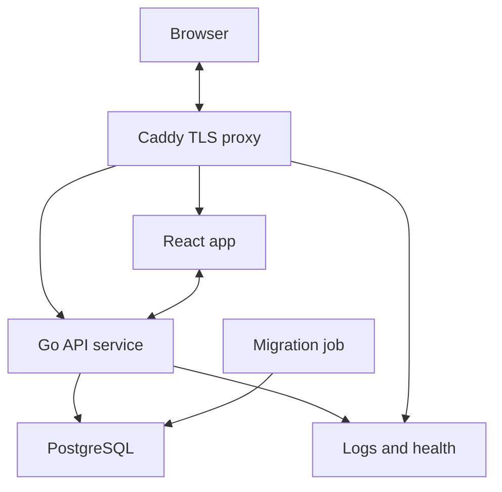
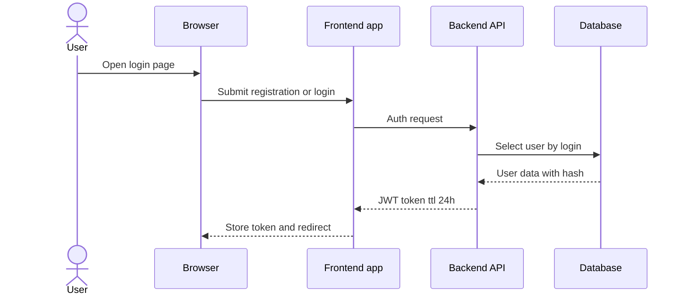
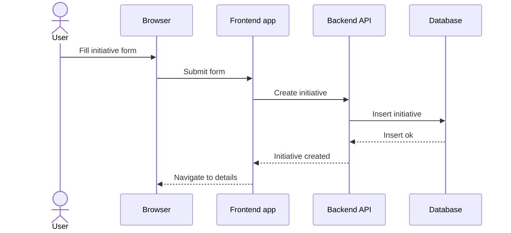
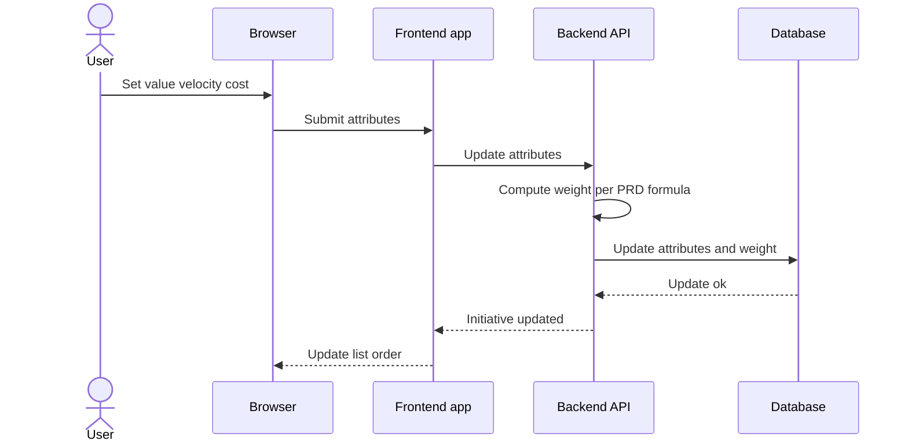
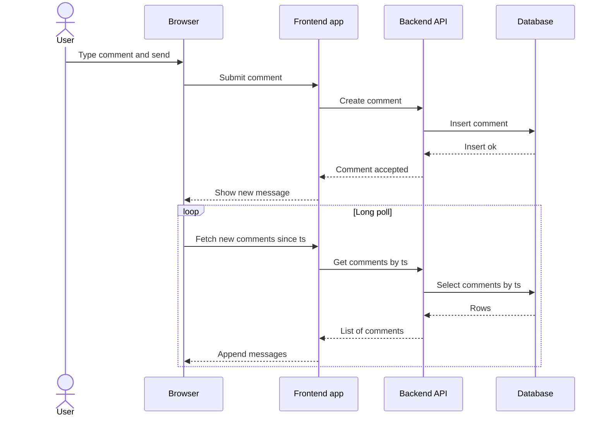
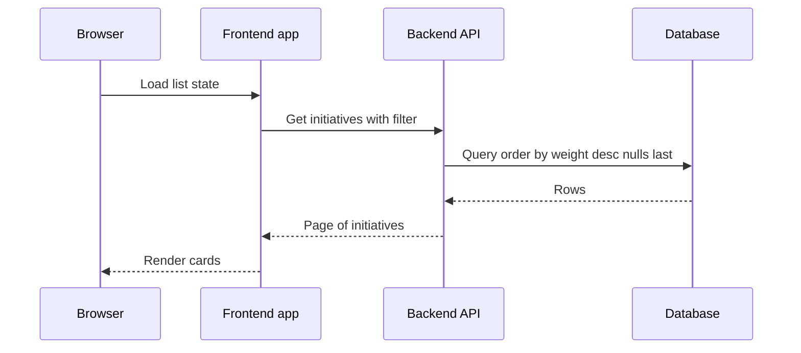

## Обзор и цели

Цель системы — поддержать сбор инициатив, их обсуждение и приоритизацию через единый веб‑клиент. Основные сценарии: создание инициатив с markdown‑описанием, чат‑комментарии, оценка атрибутов ценность скорость стоимость, назначение ответственного, фильтрация и сортировка по вычисленному весу. Архитектура ориентирована на простоту, предсказуемость и быструю реализацию MVP.

## Технологический стек
- Backend: Go сервис
- База данных: PostgreSQL
- Миграции: golang migrate как job в docker compose
- Frontend: React приложение
- Прокси и TLS: Caddy обратный прокси
- Аутентификация: JWT срок 24 часа

## Диаграмма компонентов

Комментарии:
- React app отдает статический бандл через Caddy.
- Общение клиента и сервера по HTTPS через Caddy.
- Аутентификация между Frontend и Backend через заголовок Authorization с JWT.
- Миграции запускаются как отдельная задача, применяются к PostgreSQL до старта сервиса.

## Основные потоки

### Регистрация и вход

### Создание инициативы

### Обновление атрибутов и пересчет веса

### Комментарии с лонг поллинг

### Список инициатив, фильтры и сортировка

## Данные и модель

Сущности и поля определены в PRD. Логическая модель данных будет отражена в файле db/schema.dbml и создана позже. Ключевые моменты реализации:
- Уникальный индекс по полю login.
- Ссылочная целостность для связей authorId assigneeId initiativeId.
- Диапазоны для атрибутов value velocity cost строго 1 до 5.
- Поле weight хранится как кеш и пересчитывается на сервере при изменении атрибутов.
- Список сортируется по weight по убыванию, элементы без weight в конце, затем по createdAt по убыванию.

## API контур

Подробная спецификация будет оформлена в docs/openapi.yaml. На уровне архитектуры предусмотрены ресурсы: auth users initiatives comments. Операции включают регистрацию и вход, создание инициатив, обновление атрибутов и ответственного, создание комментариев, выборки со списками и фильтрами.

## Безопасность
- Хранение паролей только в виде хеша с солью, рекомендуемый алгоритм bcrypt с достаточной стоимостью.
- JWT срок 24 часа, формат Bearer в заголовке Authorization, проверка на всех защищенных маршрутах.
- CORS настроен на домены фронтенда, методы и заголовки ограничены необходимым минимумом.
- Ввод валидируется на клиенте и на сервере. Ошибки возвращаются в явном виде без утечки лишней информации.
- Роли в текущем объеме единые, авторизация простая на уровне принадлежности сущностей текущему пользователю там где применимо.

## Наблюдаемость
- Логирование ошибок и ключевых событий на стороне Backend с уровнем info warn error.
- Health чек endpoint для статуса приложения и доступности базы данных.
- Базовые метрики запросов и ошибок на уровне прокси и Backend, при необходимости вывод в stdout и интеграция с внешними средствами.

## Архитектурные решения и компромиссы
- Реал тайм чат реализуется лонг поллинг для упрощения, WebSocket вне текущего объема.
- Вес инициативы хранится в поле weight для быстрой сортировки, источник истины вычисляется на сервере при записи атрибутов.
- Сортировка по весу выполняется на стороне базы данных, что упрощает реализацию и повышает предсказуемость.
- Одна роль пользователя снижает сложность авторизации.
- Прокси Caddy используется для TLS и маршрутизации, что упрощает выпуск сертификатов и скрывает внутренний контур.

## Границы и допущения
- Функциональность строго по PRD. Расширенные уведомления и полноценные пуш механизмы вне текущего объема.
- Хранение файлов и вложений не предусмотрено.
- Масштабирование горизонтальное не закладывается на этапе MVP, при необходимости Backend может быть масштабирован и вынесен state из памяти.

## Следующие шаги
1) Подготовить логическую модель данных в db/schema.dbml.
2) Описать API в docs/openapi.yaml.
3) Реализовать сервисы и фронтенд согласно документации.

