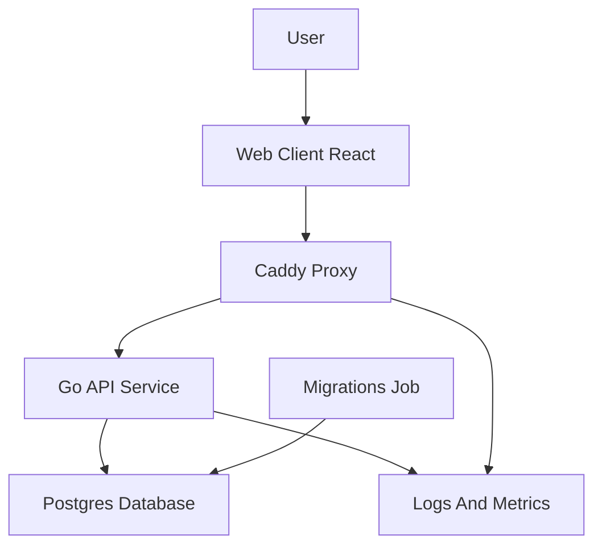
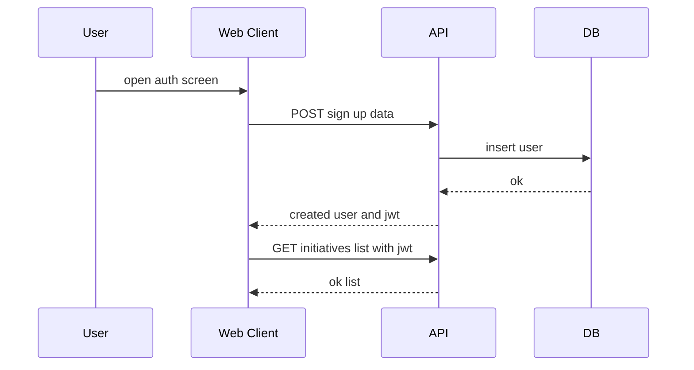
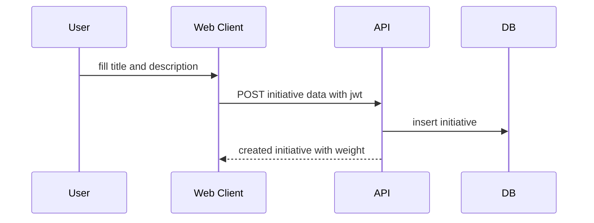
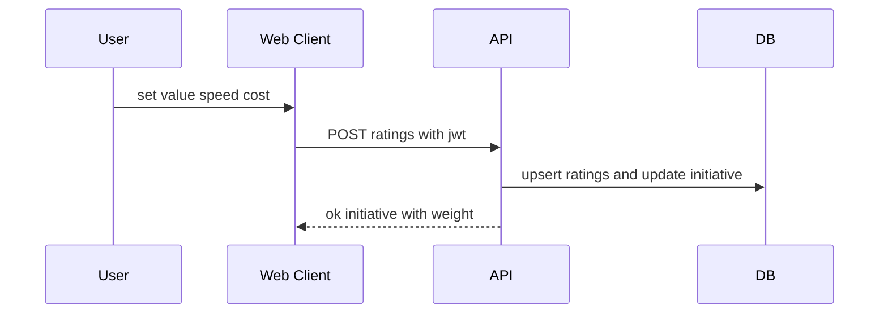
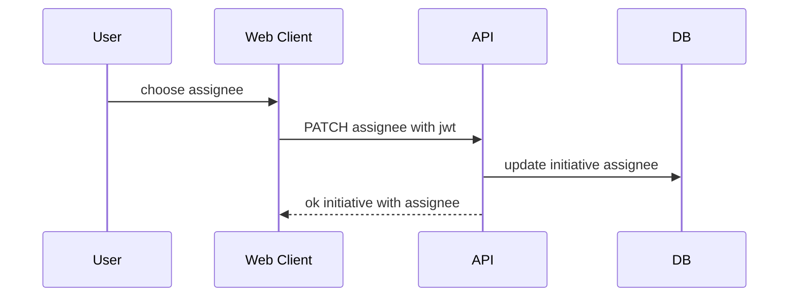
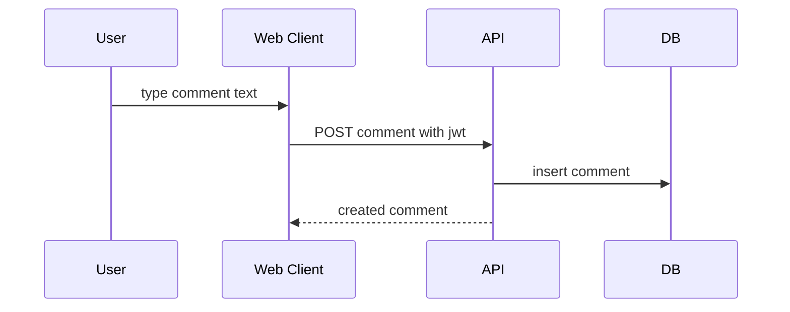
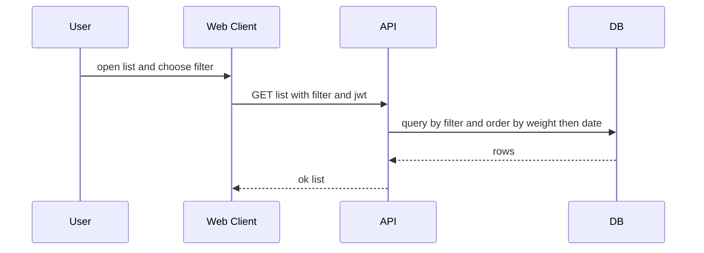

# Архитектура: Система фрейминга портфеля инициатив

Проект: «MeetAx Next». Документ фиксирует целевую архитектуру решения, ключевые компоненты, взаимодействия и потоки данных. На основе архитектуры будут подготовлены логическая модель данных (`db/schema.dbml`) и спецификация API (`docs/openapi.yaml`).

## Технологический стек
- Backend: Go монолит с HTTP API
- База данных: PostgreSQL
- Миграции: golang migrate как отдельная job в docker compose
- Frontend: React SPA, мобильный first
- Proxy и TLS: Caddy с автоматическими сертификатами и обратным прокси
- Аутентификация: JWT со сроком жизни 24 часа
- Развертывание: docker compose

## 1. Обзор и цели
- Минимальный стек для быстрого демо и последующего наращивания функционала
- Простая архитектура: один API сервис, одна база данных, один фронтенд
- Быстрое создание инициатив, оценка по шкалам, комментарии, список с фильтрами и сортировкой
- Наблюдаемость и надёжность на базовом уровне: логи, метрики, health

## 2. Диаграмма компонентов
Диаграмма показывает основные узлы и связи. Подписи узлов и стрелок избегают символов слешей и скобок.

Пояснения:
- Web Client React: одностраничное приложение, запрашивает API, хранит токен
- Caddy Proxy: завершает tls, маршрутизирует запросы к api
- Go API Service: обработка доменных операций, аутентификация, валидации
- Postgres Database: хранение данных пользователя, инициатив, комментариев и оценок
- Migrations Job: проверка и применение миграций схемы при запуске
- Logs And Metrics: сбор структурированных логов и метрик для наблюдаемости

## 3. Основные потоки
Ниже последовательности для ключевых сценариев. Названия участников и сообщений без слешей и скобок.

### 3.1 Регистрация и вход

Ключевые атрибуты: login, display name, password hash, jwt, request id, status code.

### 3.2 Создание инициативы

Ключевые атрибуты: title, description markdown, author id, created at, weight.

### 3.3 Оценка инициативы

Ключевые атрибуты: value, speed, cost, weight, updated at.

### 3.4 Назначение ответственного

Ключевые атрибуты: assignee id, updated at.

### 3.5 Комментарий к инициативе

Ключевые атрибуты: text, author id, created at, initiative id.

### 3.6 Список инициатив, фильтр и сортировка

Ключевые атрибуты: filter key, pagination, sort by weight and date, total.

## 4. Данные и модель
Будет оформлена как `db/schema.dbml`. Ориентиры по сущностям из prd:
- user: id, login, display name, password hash, created at
- initiative: id, title, description, author id, assignee id, value, speed, cost, weight, created at, updated at
- comment: id, initiative id, author id, text, created at

Правила вычисления веса: фиксированная формула с коэффициентами alpha beta gamma. Расчет на сервере при изменении атрибутов.

## 5. API контур
Полная спецификация будет в `docs/openapi.yaml`. Взаимодействие фронтенда и бэкенда использует jwt в заголовке авторизации или http only cookie. Методы охватывают аутентификацию, инициативы, оценки, комментарии и список с фильтром.

## 6. Безопасность
- JWT ttl 24 часа, хранение в http only cookie с samesite lax либо в памяти клиента с передачей в заголовке авторизации
- Пароли хэшируются с использованием argon2id или bcrypt с современными параметрами
- CORS по списку источников, заголовков и методов, минимально необходимый набор
- Валидация входных данных на сервере, ограничение длины полей
- Ограничение частоты запросов на уровне прокси и api
- TLS завершается в caddy, внутренняя сеть между сервисами доверенная

## 7. Наблюдаемость
- Структурированные логи с уровнями, корреляция по request id
- Метрики: счетчики ошибок и запросов, длительности, статус коды, бизнес метрики по событиям
- Health: liveness и readiness в api, проверка подключения к базе

## 8. ADR решения
- ADR 1: Монолит на go выбран для скорости разработки и простоты
- ADR 2: Статлес jwt выбран ради простоты, ttl 24 часа, при cookie режим samesite lax
- ADR 3: Caddy выбран как простой обратный прокси и tls терминация для демо

## 9. Ограничения и допущения
- Одна роль пользователь, разграничение прав вне скоупа
- Реалтайм чат вне скоупа, обновление списка комментариев по запросу
- Импорт экспорт и внешние интеграции вне скоупа

## 10. Связанные артефакты
- PRD: `docs/prd.md`
- Архитектура: этот документ `docs/architecture.md`
- Модель данных: будет `db/schema.dbml`
- API спецификация: будет `docs/openapi.yaml`
