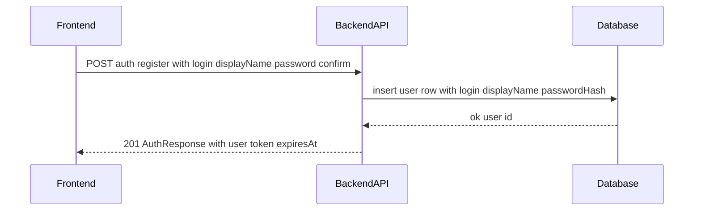
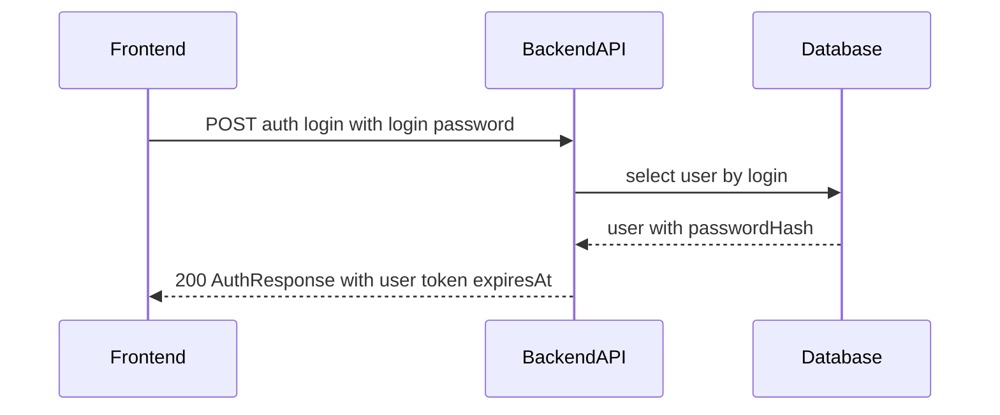

# TK-001 — Пользователи и аутентификация (JWT 24h)

## Контекст и артефакты
- **FR**: FR6 Регистрация и вход — упрощённая регистрация, вход с JWT 24 часа
- **PRD**: docs/prd.md#FR6.-Регистрация-и-вход
- **Architecture**: docs/architecture.md#3.1-Регистрация-и-вход
- **DBML**: db/schema.dbml#users
- **OpenAPI**: 
  - docs/openapi.yaml#/paths/~1auth~1register
  - docs/openapi.yaml#/paths/~1auth~1login
  - docs/openapi.yaml#/paths/~1users~1me
  - Безопасность: docs/openapi.yaml#/components/securitySchemes/bearerAuth
- **Deployment**: docs/deployment.md#переменные-окружения

## Область и границы
- **In Scope**:
  - Регистрация пользователя, автоматический вход, выдача JWT (TTL 24h)
  - Вход по логину и паролю, выдача JWT (TTL 24h)
  - Профиль текущего пользователя
  - Валидации данных, хэширование пароля, единый формат ошибок
  - Конфигурация секрета JWT через переменные окружения
  - Прокси‑маршрут/алиас для health в демо окружении
- **Out of Scope**:
  - Роли/права доступа, refresh‑токены, logout, смена/восстановление пароля
  - Подтверждение email, MFA, ограничения по IP/устройствам
  - Админ‑функции управления пользователями
- **Dependencies**:
  - Наличие таблицы `users` в БД согласно DBML
  - Переменная окружения `JWT_SECRET`; корректная настройка CORS/прокси

## Требования по слоям

### Backend
- Эндпоинты (см. OpenAPI):
  - POST /auth/register → 201 AuthResponse. Создать пользователя; хэшировать пароль; при успехе выдать JWT; конфликт логина → 409 Error.
  - POST /auth/login → 200 AuthResponse. Проверить логин/пароль; при неверных данных → 401 Error.
  - GET /users/me → 200 User. Требует bearer JWT; при отсутствии/истечении токена → 401.
- Безопасность:
  - Схема `bearerAuth` (JWT). Алгоритм HS256. TTL 24 часа.
  - Полезная нагрузка токена: { sub: userId, login, displayName, iat, exp }.
  - Секрет: `JWT_SECRET` из окружения. Ошибку конфигурации логировать и возвращать 500.
- Валидации:
  - login: 3–32, `^[a-zA-Z0-9_-]+$`, уникальный (case‑sensitive по умолчанию)
  - displayName: 1–32
  - password/confirmPassword: 8–64, совпадение при регистрации
- Ошибки: единый формат `components/schemas/Error` (код, сообщение, детали, correlationId).
- Хэширование пароля: `argon2id` (рекомендуемо) или `bcrypt` с современными параметрами. Хранить только хэш. Сравнивать тайм‑константно.
- Логи: на уровне INFO успешные вход/регистрация (без секретов), WARN — валидации/401/409, ERROR — исключения/500; добавлять correlationId.

### Frontend
- Экран аутентификации: вкладки «Вход» и «Регистрация» на одном экране.
- Состояния: loading, error (inline под полями + toast), success (редирект на список инициатив), пустые поля, disabled кнопка при невалидных данных.
- Взаимодействие:
  - Регистрация: POST /auth/register → сохранить token, expiresAt; сохранить user в store; редирект на список.
  - Вход: POST /auth/login → аналогично регистрации.
  - Профиль: GET /users/me при старте приложения для восстановления сессии; при 401 — перенос на экран входа.
- Хранение токена: безопасно в памяти приложения или HTTP‑Only cookie (в демо допускается память + Authorization заголовок).

### DevOps
- Переменные окружения (см. docs/deployment.md): `JWT_SECRET`, `BACKEND_PORT`, `APP_URL`.
- Прокси Caddy: маршрутизировать `/api/*` на backend. Для совместимости acceptance‑критерия добавить переписывание `^/api/health` → `/api/v1/health`.
- Health: `GET /api/v1/health` (и алиас `/api/health` через прокси) должен возвращать 200 и JSON по OpenAPI.

## Диаграмма последовательности — Регистрация

## Диаграмма последовательности — Вход

## Таблица взаимодействий
| Шаг | Источник | Получатель | Тип/Протокол | Ресурс/Эндпоинт | Запрос (схема) | Ответ (схема) | Атрибуты/валидации | Ошибки | Побочные эффекты |
|-----|----------|------------|--------------|------------------|----------------|---------------|--------------------|--------|------------------|
| 1 | FE | API | HTTP POST | /auth/register | `#/components/schemas/UserRegister` | `#/components/schemas/AuthResponse` | login 3–32, уникальный; пароль 8–64; confirm совпадает | 400, 409 | вставка пользователя, выдача JWT |
| 2 | API | DB | SQL | users | — | — | UNIQUE(login) | — | insert commit |
| 3 | FE | API | HTTP POST | /auth/login | `#/components/schemas/UserLogin` | `#/components/schemas/AuthResponse` | проверка пароля | 400, 401 | — |
| 4 | FE | API | HTTP GET | /users/me | — | `#/components/schemas/User` | bearer JWT | 401 | — |
| 5 | FE | API | HTTP GET | /health (через алиас к /v1/health) | — | `#/components/schemas/HealthResponse` | — | 503 | — |

## Алгоритмы и бизнес‑правила
- Выдача JWT:
  1. Проверить валидность входных данных.
  2. Для регистрации — создать пользователя с `passwordHash`.
  3. Сформировать claims: sub=userId, login, displayName, iat=now, exp=now+24h.
  4. Подписать HS256 с `JWT_SECRET`. Вернуть `AuthResponse`.
- Сравнение пароля: использовать тайм‑константную проверку хэша; одинаковые ошибки для 401.

## Модель данных (срез)
- Таблица `users` (db/schema.dbml#users): id, login, display_name, password_hash, created_at, updated_at. Индексы: уникальный по `login`.
- Соответствие API ↔ БД: `display_name` ↔ `displayName`, `password_hash` не отдаётся наружу.

## Контракты API (срез)
- POST /auth/register — docs/openapi.yaml#/paths/~1auth~1register; тело `UserRegister`, ответ `AuthResponse`.
- POST /auth/login — docs/openapi.yaml#/paths/~1auth~1login; тело `UserLogin`, ответ `AuthResponse`.
- GET /users/me — docs/openapi.yaml#/paths/~1users~1me; ответ `User`.
- Безопасность: docs/openapi.yaml#/components/securitySchemes/bearerAuth (TTL 24h).

## Логи/health/конфигурация
- Логировать: начало/результат операций, коды статусов, correlationId; не логировать секреты и хэши.
- Health: `GET /api/v1/health` по OpenAPI; алиас `/api/health` через прокси для совместимости чек‑листа.
- Конфигурация: `JWT_SECRET` обязателен; при отсутствии — FAIL FAST.

## Критерии готовности (AC)
- text: "В OpenAPI описаны /auth/register, /auth/login, /users/me; security bearer JWT 24h"
  done: false
- text: "В DBML есть таблица users со строго перечисленными полями"
  done: false
- text: "Бэкенд реализует регистрацию, логин и /users/me; соответствует OpenAPI"
  done: false
- text: "Health /api/health возвращает 200 при локальном запуске docker-compose"
  done: false

## DoR спецификации
- [x] Sequence и таблица согласованы
- [x] OpenAPI 3.0.3: paths + schemas ссылками
- [x] DBML: сущности/поля/ограничения согласованы
- [x] UX‑состояния описаны
- [x] Env/прокси указаны

