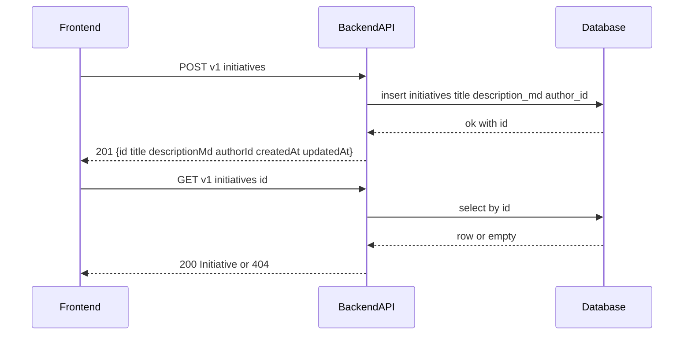

# TK-002 — Инициативы: создание и просмотр (markdown)

## Контекст и артефакты
FR: FR1 — создание инициативы с markdown-описанием
PRD: docs/prd.md#fr1-создание-инициативы-с-markdown-описанием
Architecture: docs/architecture.md#создание-инициативы
DBML: db/schema.dbml#initiatives
OpenAPI: docs/openapi.yaml#/paths/~1v1~1initiatives, docs/openapi.yaml#/paths/~1v1~1initiatives~1{id}
Deployment: docs/deployment.md#8-healthcheck-и-smoketest

## Область и границы
In:
- Создание инициативы: `POST /v1/initiatives` по схеме `InitiativeCreate` → `201 Initiative`.
- Просмотр инициативы: `GET /v1/initiatives/{id}` → `200 Initiative`.
- Базовая валидация длины полей на backend (title 1–140, descriptionMd 1–10000).
- Требования к фронтенду: форма создания и страница деталей с markdown-рендерингом.
Out:
- Редактирование/удаление инициативы.
- Список инициатив, фильтры, сортировка (покрывается TK-006).
- Комментарии, атрибуты, ответственный (TK-003, TK-004, TK-005).
Dependencies:
- Глобальная аутентификация (TK-001) — использование Bearer JWT.

## Требования по слоям
### Backend
- Эндпоинты:
  - POST `/v1/initiatives` — создать инициативу.
    - RequestBody: `#/components/schemas/InitiativeCreate` (title 1..140, descriptionMd 1..10000).
    - Поведение: автор — текущий пользователь (`authorId` из JWT `sub`), валидация длин, `createdAt/updatedAt` = now UTC.
    - Ответ: `201 Initiative`.
    - Ошибки: 400 (невалидный JSON), 401 (нет/невалидный JWT), 422 (валидация), 500.
  - GET `/v1/initiatives/{id}` — получить по id.
    - Параметры: `id` UUID.
    - Ответ: `200 Initiative` или 404.
    - Ошибки: 401, 404, 500.
- Модель/данные: использовать таблицу `initiatives` (`id`, `title`, `description_md`, `author_id`, `assignee_id?`, `value_score?`, `velocity_score?`, `cost_score?`, `weight?`, `created_at`, `updated_at`). Для TK-002 обязательны: title, description_md, author_id, created_at, updated_at.
- Маппинг полей: `description_md` → `descriptionMd`, `created_at` → `createdAt`, `updated_at` → `updatedAt`.
- Валидации:
  - title: minLength 1, maxLength 140.
  - descriptionMd: minLength 1, maxLength 10000.
- Безопасность: глобальная `bearerAuth`, исключений нет для этих эндпоинтов.
- Логи: info при создании (id, authorId), warn для 4xx, error для 5xx; без логирования содержимого `descriptionMd`.

### Frontend
- Форма создания инициативы:
  - Поля: `title` (input), `descriptionMd` (textarea / markdown editor минимальный).
  - Состояния: loading (кнопка disabled), error (inline/toast из `Error`), success (редирект на детали созданной инициативы).
  - Валидация на клиенте: такие же границы длин; отключение сабмита при пустых значениях.
  - Отправка: `POST /v1/initiatives` с JWT из хранилища; при `201` — навигация на `/initiatives/{id}`.
- Страница деталей инициативы:
  - Заголовок, автор (по `authorId` — пока текст UUID), дата создания, markdown‑рендер описания.
  - Состояния: loading, error (404/другое), success.
  - Markdown: безопасный рендер с поддержкой базовых элементов (заголовки, списки, ссылки, кодовые блоки).

### DevOps
- Новых переменных окружения не требуется.
- Health остаётся без изменений: `GET /api/health`.
- Прокси в Caddy не меняется: `/api/* → backend`.

## Диаграмма последовательности

## Таблица взаимодействий
| Шаг | Источник | Получатель | Тип/Протокол | Ресурс/Эндпоинт | Запрос (схема) | Ответ (схема) | Атрибуты/валидации | Ошибки | Побочные эффекты |
|-----|----|---|-----|-----|----|----|-----|-----|---|
| 1 | FE | API | HTTP POST | `/v1/initiatives` | `#/components/schemas/InitiativeCreate` | `#/components/schemas/Initiative` | title 1..140; descriptionMd 1..10000 | 400/401/422/500 | вставка записи |
| 2 | API | DB | SQL | `initiatives` | — | — | NOT NULL: title, description_md, author_id | — | коммит |
| 3 | FE | API | HTTP GET | `/v1/initiatives/{id}` | — | `#/components/schemas/Initiative` | id — UUID | 401/404/500 | — |
| 4 | API | DB | SQL | `initiatives` | — | — | pk by id | — | — |

## Алгоритмы и бизнес‑правила
- Автор = `sub` из JWT.
- Временные поля: `createdAt`/`updatedAt` = now UTC на сервере.
- При ошибке валидации вернуть `422 Error` c `details` по полям.

## Модель данных (срез)
- Таблица `initiatives` (db/schema.dbml#initiatives): использовать существующие поля.
- Индексы: по умолчанию из DBML. Для TK-002 новые индексы не требуются.

## Контракты API (срез)
- POST `/v1/initiatives` → `InitiativeCreate` → `201 Initiative` (`docs/openapi.yaml#/paths/~1v1~1initiatives/post`).
- GET `/v1/initiatives/{id}` → `200 Initiative` (`docs/openapi.yaml#/paths/~1v1~1initiatives~1{id}/get`).
- Общая `security: bearerAuth`.

## Логи/health/конфигурация
- Логировать создание инициативы `info` с `id` и `authorId`.
- `health` без изменений, конфигурация прокси без изменений.

## Критерии готовности (AC)
- text: "В OpenAPI описаны POST /v1/initiatives и GET /v1/initiatives/{id}; схемы Initiative/InitiativeCreate заполнены"
  done: false
- text: "В DBML таблица initiatives содержит поля title(1..140), description_md(1..10000), author_id, created_at"
  done: false
- text: "Бэкенд валидирует длины и создает запись; GET by id возвращает данные по схеме"
  done: false
- text: "Фронтенд реализует форму создания и страницу деталей; markdown рендерится через библиотеку"
  done: false

## DoR спецификации
- [ ] Sequence и таблица согласованы
- [ ] OpenAPI 3.0.3: paths + schemas
- [ ] DBML: сущности/поля/ограничения
- [ ] UX‑состояния описаны
- [ ] Env/прокси указаны (если нужно)
