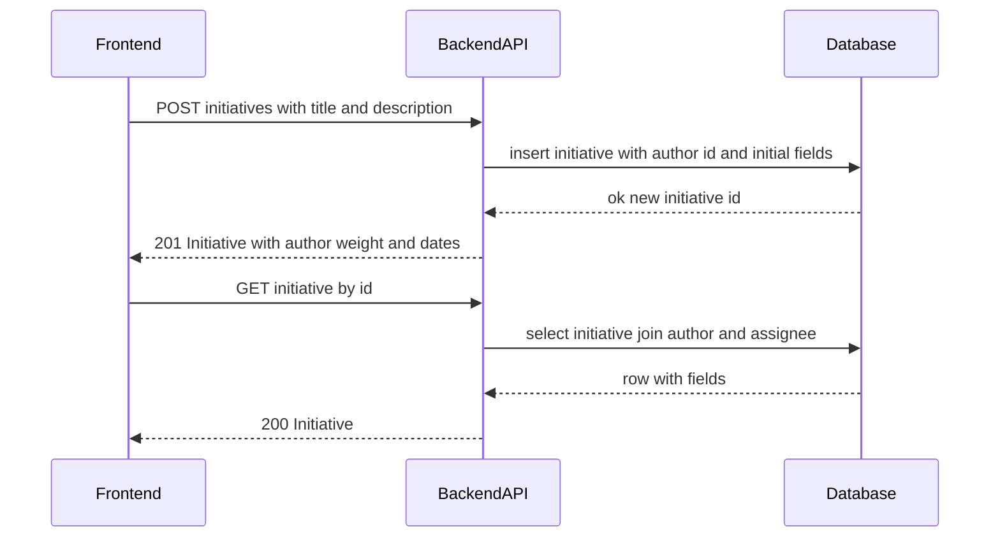

# TK-002 — Инициативы: создание и просмотр карточки

## Контекст и артефакты
- **FR**: FR1 Создание инициативы — фиксировать название и описание Markdown; после сохранения показывать карточку с автором и датой
- **PRD**: docs/prd.md#FR1.-Создание-инициативы
- **Architecture**: docs/architecture.md#3.2-Создание-инициативы
- **DBML**: db/schema.dbml#initiatives
- **OpenAPI**:
  - docs/openapi.yaml#/paths/~1initiatives (POST, GET list — контекст)
  - docs/openapi.yaml#/paths/~1initiatives~1{id} (GET)
  - docs/openapi.yaml#/components/schemas/InitiativeCreate
  - docs/openapi.yaml#/components/schemas/Initiative
- **Deployment**: docs/deployment.md#health-проверки

## Область и границы
- **In Scope**:
  - Создание инициативы текущим пользователем: валидации названия 1–140; описание Markdown ≤ 10 000, опционально
  - Просмотр карточки инициативы: автор, ответственный (может быть null), Markdown‑описание, даты, начальные атрибуты value/speed/cost (null), weight (0)
  - Согласование с моделью данных и API (без изменения схемы)
- **Out of Scope**:
  - Обновление атрибутов оценки, вычисление веса на обновлении (TK-003)
  - Назначение ответственного (TK-006)
  - Список инициатив с фильтрами/сортировкой (TK-005)
  - Комментарии (TK-004)
- **Dependencies**:
  - Наличие пользователей и механизма аутентификации (TK-001)

## Требования по слоям
### Backend
- Эндпоинты (см. OpenAPI):
  - POST /initiatives → 201 Initiative. Тело: `InitiativeCreate`. Проверки: title 1–140, description ≤ 10 000, nullable. Автор берётся из JWT. Начальные value/speed/cost = null, weight = 0.
  - GET /initiatives/{id} → 200 Initiative. Вернуть автора/ответственного (если есть), Markdown‑описание как есть, даты.
- Правила и ошибки:
  - Единый формат ошибок `#/components/schemas/Error`.
  - 400 — валидации (поля длины, пустой title), 401 — без авторизации, 404 — не найдена.
  - Логирование: INFO — создание инициативы (id, authorId), WARN — валидации/404, ERROR — исключения; с correlationId.
- Данные:
  - Таблица `initiatives` согласно DBML; поля title, description, author_id, assignee_id, value/speed/cost, weight, created_at, updated_at.
  - CHECK ограничения должны обеспечивать диапазоны и длины (миграции в TK-002/DV, упоминание в AC TK-002).

### Frontend
- Экраны/UX:
  - Экран создания: инпут title, textarea Markdown с предпросмотром, кнопка «Сохранить» disabled при невалидном title; ошибки инлайн.
  - После успешного POST — переход на карточку инициативы.
  - Карточка инициативы: отображает title, author, assignee (если есть), description (рендер Markdown: заголовки, списки, ссылки, код), createdAt/updatedAt, weight, атрибуты (если null — показывать «—»).
- Взаимодействие:
  - POST /initiatives с телом `InitiativeCreate`; при 201 — отрисовать `Initiative` и роут на `/initiatives/{id}`.
  - GET /initiatives/{id} для прямой загрузки карточки по ссылке.
- Состояния: loading (скелетон), empty (нет описания — не показывать блок Markdown), error (toast + inline), success (toast «Создано»).

### DevOps
- Ничего нового сверх существующих health‑чеков. В рамках TK-002/DV — миграции `initiatives` применяются автоматически при запуске compose.

## Диаграмма последовательности

## Таблица взаимодействий
| Шаг | Источник | Получатель | Тип/Протокол | Ресурс/Эндпоинт | Запрос (схема) | Ответ (схема) | Атрибуты/валидации | Ошибки | Побочные эффекты |
|-----|----------|------------|--------------|-----------------|----------------|----------------|--------------------|--------|------------------|
| 1 | FE | API | HTTP POST | /initiatives | `#/components/schemas/InitiativeCreate` | `#/components/schemas/Initiative` | title 1–140; description ≤ 10 000 nullable | 400/401 | insert initiative |
| 2 | API | DB | SQL | initiatives | — | — | title length; FK author_id; defaults weight=0 | — | commit |
| 3 | FE | API | HTTP GET | /initiatives/{id} | — | `#/components/schemas/Initiative` | id format uuid | 401/404 | — |
| 4 | API | DB | SQL | initiatives join users | — | — | — | — | — |

## Алгоритмы и бизнес‑правила
- Начальный вес: `0.0` при создании (атрибуты null). Пересчёты вне скоупа этой задачи.
- Рендер Markdown — ответственность фронтенда; сервер хранит сырой текст.

## Модель данных (срез)
- `db/schema.dbml#initiatives`: поля id, title, description, author_id, assignee_id, value, speed, cost, weight, created_at, updated_at; индексы: `(weight, created_at)`, `author_id`, `assignee_id`, `created_at`.
- Ограничения (в миграциях TK-002/DV):
  - `title` длина 1–140
  - `description` ≤ 10 000 или NULL

## Контракты API (срез)
- POST /initiatives — `docs/openapi.yaml#/paths/~1initiatives/post`; тело `InitiativeCreate`; 201 `Initiative`; ошибки `Error`.
- GET /initiatives/{id} — `docs/openapi.yaml#/paths/~1initiatives~1{id}/get`; 200 `Initiative`; 404 `NotFound`; 401 `Unauthorized`.

## Логи/health/конфигурация
- Логи: INFO создание инициативы (без содержимого description); WARN валидации/404; ERROR исключения. Коррелируем по correlationId.
- Health: без изменений; использовать `GET /health`.

## Критерии готовности (AC)
- text: "POST /initiatives создаёт инициативу, валидации названия/описания соблюдены"
  done: false
- text: "GET /initiatives/{id} возвращает инициативу с автором и датами"
  done: false
- text: "Markdown описания корректно передаётся и хранится"
  done: false
- text: "Миграции для таблицы initiatives применяются автоматически"
  done: false

## DoR спецификации
- [x] Sequence и таблица согласованы
- [x] OpenAPI 3.0.3: paths + schemas ссылками
- [x] DBML: сущности/поля/ограничения согласованы
- [x] UX‑состояния описаны
- [x] Env/прокси указаны (не требуется дополнений)
