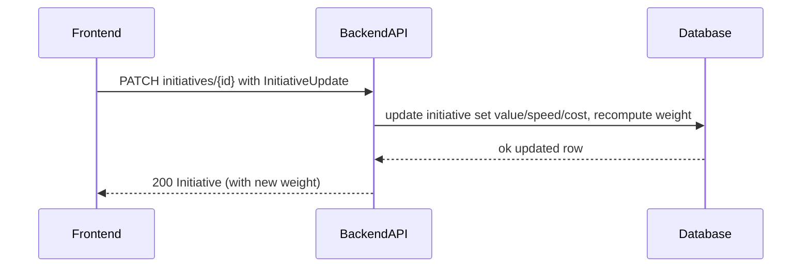

# TK-003 — Атрибуты оценки и расчёт веса инициативы

## Контекст и артефакты
- **FR**: FR3 Атрибуты оценки инициативы (1–5) — ввод и пересчёт веса
- **PRD**: docs/prd.md#FR3.-Атрибуты-оценки-инициативы-1–5
- **Architecture**: docs/architecture.md#3.3-Оценка-инициативы
- **DBML**: db/schema.dbml#initiatives
- **OpenAPI**:
  - docs/openapi.yaml#/paths/~1initiatives~1{id}/patch
  - docs/openapi.yaml#/components/schemas/InitiativeUpdate
  - docs/openapi.yaml#/components/schemas/Initiative
- **Deployment**: docs/deployment.md#мониторинг-и-метрики

## Область и границы
- **In Scope**:
  - Обновление атрибутов инициативы: `value`, `speed`, `cost` (целые 1–5 или null)
  - Вычисление и сохранение `weight` на сервере по формуле из PRD
  - Валидации диапазона на уровне API и БД (CHECK)
  - Возврат обновлённой карточки инициативы
  - Обновление UI карточки: контролы 1–5, показ текущего веса, optimistic/после сохранения
- **Out of Scope**:
  - Назначение ответственного (`assigneeId`) — отдельная задача TK-006
  - Список инициатив с сортировкой/фильтрами — TK-005
  - Комментарии — TK-004
- **Dependencies**:
  - Пользователи и аутентификация (TK-001)
  - Создание и просмотр карточки инициативы (TK-002)

## Требования по слоям

### Backend
- Эндпоинт (см. OpenAPI):
  - `PATCH /initiatives/{id}` → 200 `Initiative`; тело `InitiativeUpdate`
- Валидации и правила:
  - Поля `value`, `speed`, `cost`: `null` или integer ∈ [1,5]; при нарушении → 400 `Error`
  - Пересчёт `weight` при любом изменении любого из трёх атрибутов
  - Формула: `weight = round((0.5*value + 0.3*speed - 0.2*cost) / 1.0, 2)`; если какой‑то атрибут `null`, при расчёте он игнорируется, а знаменатель — сумма коэффициентов только по присутствующим атрибутам; если все `null` → `weight = 0.0`
  - `updated_at` обновляется при успешном изменении
  - Ошибки: единый формат `#/components/schemas/Error` (400/401/404)
- Данные/БД:
  - Таблица `initiatives`: `value`, `speed`, `cost` smallint nullable; `weight` numeric(5,2) not null default 0
  - CHECK ограничения: каждое из `value|speed|cost` либо `NULL`, либо в [1,5]
- Логи/метрики:
  - INFO: обновление атрибутов (id, userId, изменённые поля, новый weight)
  - WARN: валидации/404; ERROR: исключения
  - Метрики: счётчик успешных/ошибочных обновлений

### Frontend
- UI/UX:
  - В карточке инициативы три контролла (радио/селект/степпер) для `value/speed/cost` c подсказками 1–5
  - Кнопка «Сохранить» активна при изменениях; при сабмите — disable + индикатор
  - После успешного ответа — обновить `weight` и значения на карточке; показать toast «Сохранено»
  - Негативные состояния: подсветка ошибок диапазона; откат к предыдущему значению или отображение серв. ошибки
- Взаимодействие:
  - `PATCH /initiatives/{id}` с телом `InitiativeUpdate` (только изменённые поля)
  - Обновить локальное состояние карточки ответом сервера

### DevOps
- Миграции для CHECK‑ограничений `value/speed/cost` (если ещё не применены)
- Наблюдаемость: логи успешных/ошибочных обновлений; базовые метрики

## Диаграмма последовательности

## Таблица взаимодействий
| Шаг | Источник | Получатель | Тип | Ресурс | Запрос | Ответ | Валидации | Ошибки | Побочные эффекты |
|-----|----------|------------|-----|--------|--------|-------|-----------|--------|------------------|
| 1 | FE | API | HTTP PATCH | /initiatives/{id} | `InitiativeUpdate` | `Initiative` | 1–5 или null | 400/401/404 | update row, set updated_at |

## Алгоритмы и бизнес‑правила
- Расчёт веса с учётом пропусков:
  - Пусть присутствующие атрибуты: S ⊆ {value, speed, cost}
  - Коэфф.: α=0.5 (value), β=0.3 (speed), γ=0.2 (cost)
  - Числитель: сумма `coef(attr) * value(attr)` по S
  - Знаменатель: сумма `coef(attr)` по S; если S=∅ → weight=0.0
  - Округление до 2 знаков после запятой

## Модель данных (срез)
- `db/schema.dbml#initiatives`: value/speed/cost nullable smallint; weight numeric(5,2) not null default 0
- CHECK: диапазон 1–5 или NULL для каждого поля

## Контракты API (срез)
- `docs/openapi.yaml#/paths/~1initiatives~1{id}/patch` — тело `InitiativeUpdate`, ответ `Initiative`
- `docs/openapi.yaml#/components/schemas/InitiativeUpdate` — min=1 max=5, nullable

## Негативные кейсы
- Переданы значения вне диапазона (0, 6, отрицательные) → 400 Error
- Пустое тело запроса (ничего не меняется) → 200 с неизменёнными данными или 400 (решение BE); рекомендуется поддержать no‑op 200
- Несуществующая инициатива → 404 NotFound
- Без авторизации → 401 Unauthorized

## Критерии готовности (AC) для TK-003
- PATCH /initiatives/{id} принимает value/speed/cost 1–5 и обновляет weight
- Формула веса соответствует PRD (0.5*value + 0.3*speed − 0.2*cost)
- В БД CHECK‑ограничения на диапазон 1–5 или NULL
- Фронтенд обновляет вес на карточке после сохранения

## DoR спецификации
- [x] Sequence и таблица согласованы
- [x] OpenAPI 3.0.3: paths + schemas ссылками
- [x] DBML: сущности/поля/ограничения согласованы
- [x] UX‑состояния и негативные кейсы описаны
- [x] Логи/метрики обозначены
