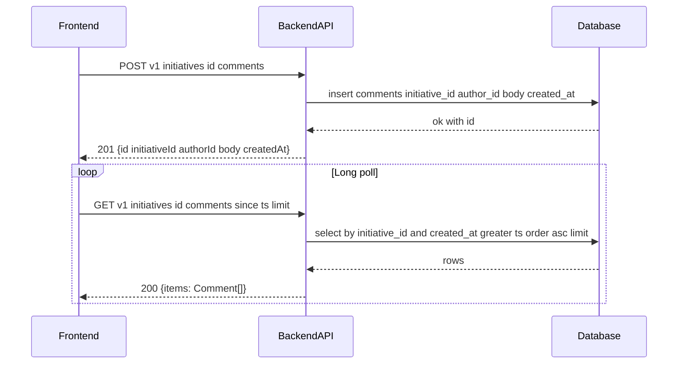

# TK-003 — Комментарии к инициативе (лонг поллинг)

## Контекст и артефакты
FR: FR2 — комментарии в формате чата (добавление, показ по времени, авто‑прокрутка)
PRD: docs/prd.md#fr2-комментарии-в-формате-чата
Architecture: docs/architecture.md#комментарии-с-лонг-поллинг
DBML: db/schema.dbml#comments
OpenAPI: docs/openapi.yaml#/paths/~1v1~1initiatives~1{id}~1comments
Deployment: docs/deployment.md

## Область и границы
In:
- Добавление комментария к инициативе: POST /v1/initiatives/{id}/comments → 201 Comment.
- Получение комментариев по инициативе: GET /v1/initiatives/{id}/comments с опциональным since (RFC3339), сортировка по времени по возрастанию.
- Клиентская лента чата с автопрокруткой к последнему сообщению и ретраями long poll.
- Базовая обработка ошибок и повторная отправка.
Out:
- WebSocket/Server‑Sent Events (вне объёма; используется long polling).
- Редактирование/удаление комментариев.
- Уведомления/упоминания.
Dependencies:
- TK-001 (JWT, /users/me), TK-002 (детали инициативы доступны, идентификатор инициативы известен).

## Требования по слоям
### Backend
- Эндпоинты:
  - POST `/v1/initiatives/{id}/comments`
    - Путь: `id` — UUID инициативы.
    - RequestBody: `#/components/schemas/CommentCreate` (`body` 1..2000).
    - Поведение: автор = текущий пользователь (`authorId` из JWT `sub`), `createdAt` = now UTC. Проверить существование инициативы; при отсутствии — 404.
    - Ответ: `201 Comment` с полями `id, initiativeId, authorId, body, createdAt`.
    - Ошибки: 400 (невалидный JSON), 401 (нет/невалидный JWT), 404 (initiative), 422 (валидация body), 500.
  - GET `/v1/initiatives/{id}/comments`
    - Параметры: `id` UUID; query `since` (date-time, RFC3339, опц.), `limit` 1..200 (по умолчанию 50).
    - Поведение: возвращать комментарии указанной инициативы, строго по возрастанию `createdAt`. Если `since` задан — только записи, где `createdAt` > `since` (строго новее).
    - Ответ: `200 CommentList { items: Comment[] }`.
    - Ошибки: 401, 404, 500.
- Данные/модель:
  - Таблица `comments` уже определена в DBML: `id uuid pk`, `initiative_id uuid fk`, `author_id uuid fk`, `body varchar(2000) not null`, `created_at timestamptz not null default now()`.
  - Индексы: по `initiative_id`, `author_id`, `created_at` (см. DBML); выборка по инициативе с фильтром по времени и сортировкой ASC.
- Валидации:
  - `body`: minLength 1, maxLength 2000; обрезать ведущие/хвостовые пробелы перед проверкой.
  - `since`: корректный RFC3339, с учётом UTC; при неверном формате — 400.
- Безопасность: глобальная `bearerAuth`; доступ только для авторизованных пользователей.
- Логи: info при создании комментария (id, initiativeId, authorId), warn для 4xx (без тел), error для 5xx.

### Frontend
- Лента чата на странице деталей инициативы:
  - Отрисовывать сообщения по `createdAt` по возрастанию; группировка по времени (микро‑заголовки опционально).
  - Автопрокрутка к последнему сообщению при добавлении нового или при первом загрузке/получении после long poll.
  - Пустое состояние: «Пока нет сообщений. Будьте первым». Ошибки — toast/inline, с возможностью повторить.
- Отправка сообщения:
  - Поле ввода (textarea, Enter — отправка, Shift+Enter — перенос строки); дизейбл при пустом/пробельном тексте.
  - После `201` добавлять комментарий в конец ленты; при ошибке — показывать ошибку и позволять «Повторить».
- Long polling протокол:
  - Клиент хранит локальную метку `lastTs` (последний `createdAt` из полученных сообщений, либо время первой загрузки — `new Date().toISOString()` при пустой ленте).
  - Запрос: периодический `GET /v1/initiatives/{id}/comments?since=<lastTs>&limit=200`.
  - Таймаут ожидания ответа на уровне клиента: ~25–30 c; интервал повторов при отсутствии новых сообщений: 0–1 c (немедленный повтор) для ощущения «реального времени».
  - Ретраи при сетевых ошибках: экспоненциальная задержка 1s, 2s, 4s… до 30s, затем стабилизация на 30s; сброс при первом успешном ответе.
  - Обработка 401: инициировать логаут и перенаправление на логин.
  - Обработка 404: показать, что инициатива недоступна/удалена; прекратить поллинг.

### DevOps
- Новых env‑переменных не требуется.
- Прокси/маршруты без изменений (см. deployment.md). Health без изменений.

## Диаграмма последовательности

## Таблица взаимодействий
| Шаг | Источник | Получатель | Тип/Протокол | Ресурс/Эндпоинт | Запрос (схема) | Ответ (схема) | Атрибуты/валидации | Ошибки | Побочные эффекты |
|-----|----------|------------|--------------|-----------------|----------------|----------------|--------------------|--------|------------------|
| 1 | FE | API | HTTP POST | `/v1/initiatives/{id}/comments` | `#/components/schemas/CommentCreate` | `#/components/schemas/Comment` | body 1..2000; id — UUID | 400/401/404/422/500 | вставка записи |
| 2 | API | DB | SQL | `comments` | — | — | fk initiative_id, author_id; created_at now() | — | коммит |
| 3 | FE | API | HTTP GET | `/v1/initiatives/{id}/comments` | since (RFC3339), limit 1..200 | `#/components/schemas/CommentList` | order by created_at asc; since — строго больше | 401/404/500 | — |
| 4 | API | DB | SQL | `comments` | — | — | where initiative_id=? and created_at>?, order by created_at asc, limit | — | — |

## Алгоритмы и бизнес‑правила
- Определение новизны: запись считается «новой» для клиента, если `createdAt` строго больше локально сохранённого `lastTs`.
- Формирование `lastTs`: при получении пачки обновлять `lastTs` последним `createdAt`; при отсутствии новых — не изменять.
- Клиентская де‑дупликация: при повторном получении одинаковых `id` игнорировать добавление.
- Пагинация: параметр `limit` ограничивает максимальный размер ответа; клиент может уменьшить до 100–200 для UX.

## Модель данных (срез)
- `db/schema.dbml#comments` — структура таблицы и индексы, соответствуют требованиям (длины, ссылки, created_at).
- Связи: `comments.initiative_id` → `initiatives.id` (cascade delete), `comments.author_id` → `users.id`.

## Контракты API (срез)
- POST `/v1/initiatives/{id}/comments` → `201 Comment` (`docs/openapi.yaml#/paths/~1v1~1initiatives~1{id}~1comments/post`).
- GET `/v1/initiatives/{id}/comments?since&limit` → `200 CommentList` (`docs/openapi.yaml#/paths/~1v1~1initiatives~1{id}~1comments/get`).
- Общая `security: bearerAuth`.

## Логи/health/конфигурация
- Логировать: создание комментария (info), ошибки валидации/поиска инициативы (warn), внутренние ошибки (error). Не логировать содержимое `body`.
- Health/инфраструктура без изменений.

## Критерии готовности (AC)
- text: "В OpenAPI описаны GET/POST /v1/initiatives/{id}/comments; параметр since (RFC3339) поддерживается"
  done: false
- text: "В DBML таблица comments содержит поля initiative_id, author_id, body(1..2000), created_at"
  done: false
- text: "Бэкенд реализует добавление и выборку комментариев по возрастанию времени, фильтр since"
  done: false
- text: "Фронтенд реализует ленту чата с автопрокруткой и обработкой ошибок"
  done: false

## DoR спецификации
- [ ] Sequence и таблица согласованы
- [ ] OpenAPI 3.0.3: paths + schemas
- [ ] DBML: сущности/поля/ограничения
- [ ] UX‑состояния описаны
- [ ] Env/прокси указаны (если нужно)
