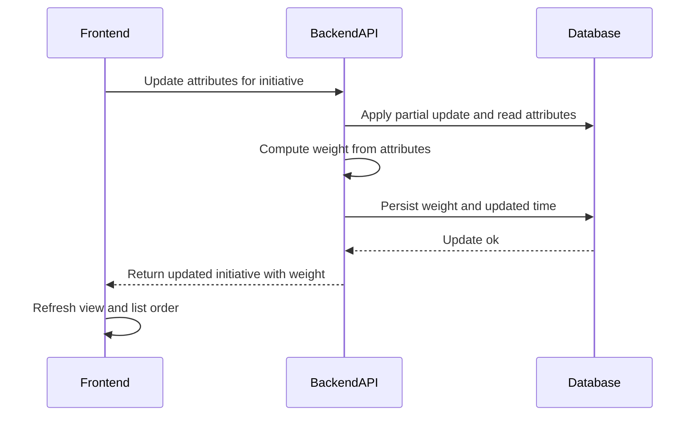

# TK-004 — Атрибуты 1–5 и расчёт веса инициативы

## Контекст и артефакты
FR: FR3 — атрибуты инициативы 1–5; FR4 — расчёт итогового веса
PRD: docs/prd.md#fr3-атрибуты-инициативы-ценность-скорость-стоимость-1–5, docs/prd.md#fr4-расчёт-итогового-веса-инициативы
Architecture: docs/architecture.md#обновление-атрибутов-и-пересчет-веса
DBML: db/schema.dbml#initiatives
OpenAPI: docs/openapi.yaml#/paths/~1v1~1initiatives~1{id}~1attributes, docs/openapi.yaml#/components/schemas/InitiativeAttributesUpdate, docs/openapi.yaml#/components/schemas/Initiative
Deployment: docs/deployment.md#8-healthcheck-и-smoketest

## Область и границы
In:
- Обновление атрибутов инициативы: value, velocity, cost (целые 1..5), частичное обновление.
- Пересчёт поля weight на сервере по формуле PRD с округлением до десятых.
- Отображение и управление атрибутами на карточке и в деталях инициативы; показ weight с одним знаком или «—», если вычисление невозможно.
Out:
- Комментарии (TK-003), назначение ответственного (TK-005), список/фильтры/сортировка (TK-006).
Dependencies:
- TK-001 (аутентификация JWT) — все вызовы защищены.
- TK-002 (инициативы: создание и просмотр) — базовая модель и отображение деталей.

## Требования по слоям
### Backend
- Endpoint: PATCH `/v1/initiatives/{id}/attributes`.
  - Параметры: `id` — UUID (path).
  - Тело запроса: `InitiativeAttributesUpdate` (minProperties: 1; свойства `value`, `velocity`, `cost` в диапазоне 1..5).
  - Ответ: `200 Initiative` (обновлённые поля и `weight`), `404` если инициатива не найдена, `401` без авторизации, `422` при нарушении диапазона, `400` при невалидном JSON.
- Валидации:
  - Диапазон для каждого переданного атрибута: 1..5 (integer). Ошибки формата — `422 Error` с `details` по полям.
  - Разрешено частичное обновление: присутствующие поля меняются, отсутствующие — остаются без изменений.
- Пересчёт веса:
  - После применения обновлений прочитать актуальные `value`, `velocity`, `cost` из записи.
  - Если все три заданы (не NULL): `weight = round((value × velocity) / cost, 1)` — округление «математическое» до 1 знака (0.05 вверх).
  - Если какой-либо из трёх NULL — `weight = NULL`.
  - Поле `updatedAt` обновлять на текущее время UTC при фактическом изменении хотя бы одного из полей `value/velocity/cost/weight`.
- Модель/данные:
  - Таблица `initiatives`: `value_score smallint`, `velocity_score smallint`, `cost_score smallint`, `weight numeric(3,1)`.
  - Маппинг JSON ↔ БД: `value` ↔ `value_score`, `velocity` ↔ `velocity_score`, `cost` ↔ `cost_score`, `weight` ↔ `weight`.
  - Добавить миграционные ограничения CHECK: `value_score BETWEEN 1 AND 5`, `velocity_score BETWEEN 1 AND 5`, `cost_score BETWEEN 1 AND 5` (учесть NULL как допустимое значение).
- Ошибки и логи:
  - Логи: `info` при успешном обновлении (id, изменённые поля), `warn` для 4xx, `error` для 5xx.
  - Формат ошибок: `components/schemas/Error`.

### Frontend
- Контролы 1..5 для `value`, `velocity`, `cost` на карточке инициативы и на странице деталей.
- Состояния: `idle` → `saving` (дизейбл контролов) → `success` (обновить отображение `weight`) / `error` (toast/inline, подсветка полей).
- Отправка: PATCH `/v1/initiatives/{id}/attributes` с телом из изменённых полей. По `200` использовать `weight` из ответа и, если находимся в списке, обновить порядок.
- Отображение `weight`: число с одним знаком после запятой или «—», если `weight=null`.
- Можно локально предрассчитать `weight` для отзывчивости UI, но источником истины остаётся значение из ответа сервера.

### DevOps
- Новых переменных окружения не требуется. Прокси/health — без изменений.

## Диаграмма последовательности


## Таблица взаимодействий
| Шаг | Источник | Получатель | Тип/Протокол | Ресурс/Эндпоинт | Запрос (схема) | Ответ (схема) | Атрибуты/валидации | Ошибки | Побочные эффекты |
|-----|----|---|-----|-----|----|----|-----|-----|---|
| 1 | FE | API | HTTP PATCH | `/v1/initiatives/{id}/attributes` | `#/components/schemas/InitiativeAttributesUpdate` | `#/components/schemas/Initiative` | minProperties:1; значения 1..5 | 400/401/404/422/500 | — |
| 2 | API | DB | SQL | `initiatives` | — | — | Проверка CHECK/типов; частичное обновление | — | запись обновлена |
| 3 | API | API | compute | — | — | — | Все три заданы → round((v×vel)/cost,1) | — | рассчёт `weight` |
| 4 | API | DB | SQL | `initiatives` | — | — | Обновить `weight`, `updated_at` | — | коммит |
| 5 | API | FE | HTTP 200 | — | — | `Initiative` | — | — | UI обновлён |

## Алгоритмы и бизнес‑правила
1) Частичное обновление:
```
inputFields := {value?, velocity?, cost?}; require at least one
validate each present ∈ [1..5]
apply partial update
attrs := read(value, velocity, cost)
if attrs all not null:
  weight := round((value*velocity)/cost, 1)
else:
  weight := null
persist weight (if changed); updatedAt := now UTC when any of value/velocity/cost/weight changed
return Initiative
```
2) Округление: «математическое» до одного знака (пример: 7.45 → 7.5; 7.44 → 7.4).
3) Сортировка списка (для справки): ORDER BY weight DESC NULLS LAST, createdAt DESC.

## Модель данных (срез)
- `db/schema.dbml#initiatives`:
  - `value_score smallint`, `velocity_score smallint`, `cost_score smallint` (NULL допускается), `weight numeric(3,1)` (NULL допускается).
  - Индексы: `initiatives_weight_desc_idx` (weight), `initiatives_created_at_desc_idx` (created_at).
- Требование к миграциям: добавить CHECK‑ограничения на диапазоны 1..5 с учётом NULL.

## Контракты API (срез)
- PATCH `/v1/initiatives/{id}/attributes` → `200 Initiative` (`docs/openapi.yaml#/paths/~1v1~1initiatives~1{id}~1attributes/patch`).
- `InitiativeAttributesUpdate` (`docs/openapi.yaml#/components/schemas/InitiativeAttributesUpdate`).
- `Initiative` (`docs/openapi.yaml#/components/schemas/Initiative`).

## Логи/health/конфигурация
- Логи backend: `info` — успешное обновление (id, изменённые поля), `warn` — валидации/не найдено, `error` — внутренние.
- Health/прокси — без изменений (см. `docs/deployment.md`).

## Критерии готовности (AC)
- text: "В OpenAPI описан PATCH /v1/initiatives/{id}/attributes с ограничениями 1..5 и minProperties:1"
  done: false
- text: "В DB миграциях добавлены CHECK‑ограничения 1..5; поле weight numeric(3,1)"
  done: false
- text: "Бэкенд вычисляет weight = round((value×velocity)/cost, 1), при неполном наборе атрибутов weight=null"
  done: false
- text: "Фронтенд показывает контролы 1..5 и отображает вес с одним знаком"
  done: false

## DoR спецификации
- [ ] Sequence и таблица согласованы
- [ ] OpenAPI 3.0.3: paths + schemas
- [ ] DBML: сущности/поля/ограничения
- [ ] UX‑состояния описаны
- [ ] Env/прокси указаны (если нужно)


