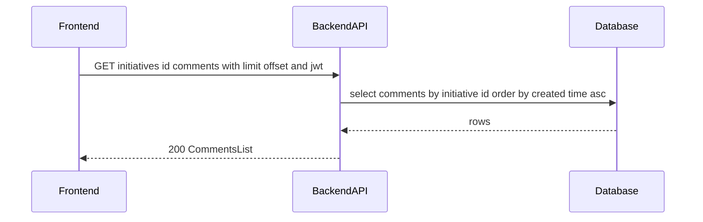
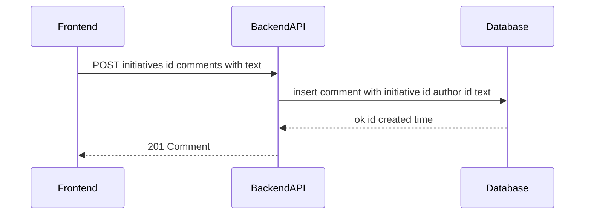

# TK-004 — Комментарии к инициативам (чат‑лента)

## Контекст и артефакты
- **FR**: FR2 Комментарии в формате чата — пользователи добавляют сообщения; текст 1–1000; упорядочение по времени
- **PRD**: docs/prd.md#FR2.-Комментарии-в-формате-чата
- **Architecture**: docs/architecture.md#3.5-Комментарий-к-инициативе
- **DBML**: db/schema.dbml#comments
- **OpenAPI**:
  - docs/openapi.yaml#/paths/~1initiatives~1{id}~1comments
  - docs/openapi.yaml#/components/schemas/Comment
  - docs/openapi.yaml#/components/schemas/CommentCreate
  - docs/openapi.yaml#/components/schemas/CommentsList
- **Deployment**: docs/deployment.md#health-проверки

## Область и границы
- **In Scope**:
  - Получение списка комментариев к инициативе (пагинация limit/offset, хронологический порядок)
  - Добавление нового комментария (валидация 1–1000 символов, запрет пустых/пробельных сообщений)
  - UX состояний на фронтенде: loading, empty, error, success; блокировка кнопки «Отправить» при пустом вводе
  - Единый формат ошибок API
- **Out of Scope**:
  - Редактирование/удаление комментариев, реакции, вложения, Markdown в тексте комментариев
  - Реалтайм‑обновления/вебсокеты (обновление через явную перезагрузку списка после отправки)
  - Упоминания, нити обсуждений, цитирование
- **Dependencies**:
  - TK-001 (аутентификация): авторизация через bearer JWT
  - Наличие инициативы (TK-002) — 404 при отсутствии
  - Миграции таблицы `comments` и индексов — TK-004/DV

## Требования по слоям
### Backend
- Эндпоинты (см. OpenAPI):
  - GET /initiatives/{id}/comments → 200 CommentsList. Параметры: limit (1..100, по умолчанию 50), offset (≥0). Возвращает список по возрастанию времени создания. Ошибки: 401, 404.
  - POST /initiatives/{id}/comments → 201 Comment. Тело: CommentCreate{text}. Валидация: `text` после trim — длина 1..1000. Ошибки: 400, 401, 404.
- Безопасность: bearerAuth (JWT). Автор комментария определяется по `sub` из токена.
- Хранилище: вставка строки в `comments` с `initiative_id`, `author_id`, `text`, `created_at=now()`.
- Сортировка: при чтении — `ORDER BY created_at ASC`.
- Ошибки: единый формат `components/schemas/Error` с `code`, `message`, `details`, `correlationId`.
- Нагрузочные/пограничные случаи: текст из одних пробелов → 400; превышение 1000 → 400; несуществующая инициатива → 404.

### Frontend
- Экран карточки инициативы: секция «Комментарии» внизу.
- Список: хронологический, с автоматическим скроллом к последнему сообщению после отправки.
- Форма ввода: однострочный/многострочный инпут (auto‑grow) + кнопка «Отправить».
- Состояния: 
  - loading: скелетоны/спиннер вместо ленты;
  - empty: текст «Пока нет комментариев»;
  - error: inline ошибка под формой + toast;
  - success: очистка инпута, показ созданного комментария.
- Валидация: локально блокировать кнопку при `trim(text).length === 0` или `> 1000`.
- Взаимодействие с API:
  - При открытии карточки — GET comments (limit=50, offset=0).
  - При отправке — POST comment; при успехе либо догружать созданный комментарий локально, либо повторно выполнить GET.

### DevOps
- Новых env‑переменных нет. Прокси Caddy уже маршрутизирует `/api/*` на backend.
- Health/observability без изменений; логирование запросов и корреляция по request id.

## Диаграмма последовательности — Загрузка комментариев

## Диаграмма последовательности — Отправка комментария

## Таблица взаимодействий
| Шаг | Источник | Получатель | Тип/Протокол | Ресурс/Эндпоинт | Запрос (схема) | Ответ (схема) | Атрибуты/валидации | Ошибки | Побочные эффекты |
|-----|----------|------------|--------------|------------------|----------------|---------------|--------------------|--------|------------------|
| 1 | FE | API | HTTP GET | /initiatives/{id}/comments | — | `#/components/schemas/CommentsList` | limit 1..100, offset ≥0; сортировка по времени | 401, 404 | — |
| 2 | API | DB | SQL | comments | — | — | WHERE initiative_id; ORDER BY created_at ASC | — | — |
| 3 | FE | API | HTTP POST | /initiatives/{id}/comments | `#/components/schemas/CommentCreate` | `#/components/schemas/Comment` | trim(text) длина 1..1000 | 400, 401, 404 | вставка комментария |
| 4 | API | DB | SQL | comments | — | — | CHECK длины 1..1000 (на уровне миграции) | — | insert commit |

## Алгоритмы и бизнес‑правила
- Нормализация текста при приёме: `text = trim(text)`; пустой результат → ошибка валидации.
- Порядок отображения: строго по `created_at ASC`.

## Модель данных (срез)
- Таблица `comments` (db/schema.dbml#comments): поля `id`, `initiative_id`, `author_id`, `text`, `created_at`; индексы `(initiative_id, created_at)` и `author_id`.
- Ограничения (в миграциях): длина `text` 1–1000; FK на `initiatives.id` и `users.id`.

## Контракты API (срез)
- GET /initiatives/{id}/comments — docs/openapi.yaml#/paths/~1initiatives~1{id}~1comments/get; ответ `CommentsList`.
- POST /initiatives/{id}/comments — docs/openapi.yaml#/paths/~1initiatives~1{id}~1comments/post; тело `CommentCreate`, ответ `Comment`.
- Схемы: `Comment`, `CommentCreate`, `CommentsList` в `components/schemas`.
- Безопасность: `components/securitySchemes/bearerAuth`.

## Логи/health/конфигурация
- Логи: INFO — успешное создание комментария (без текста целиком), WARN — валидации/404/401, ERROR — исключения/500; добавлять correlationId.
- Health: без изменений; `GET /api/v1/health` по OpenAPI.
- Конфигурация: новых параметров нет.

## Критерии готовности (AC)
- text: "POST /initiatives/{id}/comments создаёт комментарий; валидации 1–1000 символов"
  done: false
- text: "GET /initiatives/{id}/comments возвращает хронологический список"
  done: false
- text: "Фронтенд блокирует отправку пустых сообщений"
  done: false
- text: "Индикаторы загрузки/ошибок присутствуют"
  done: false

## DoR спецификации
- [x] Sequence и таблица согласованы
- [x] OpenAPI 3.0.3: paths + schemas ссылками
- [x] DBML: сущности/поля/ограничения согласованы
- [x] UX‑состояния описаны
- [x] Env/прокси указаны (если нужно)
