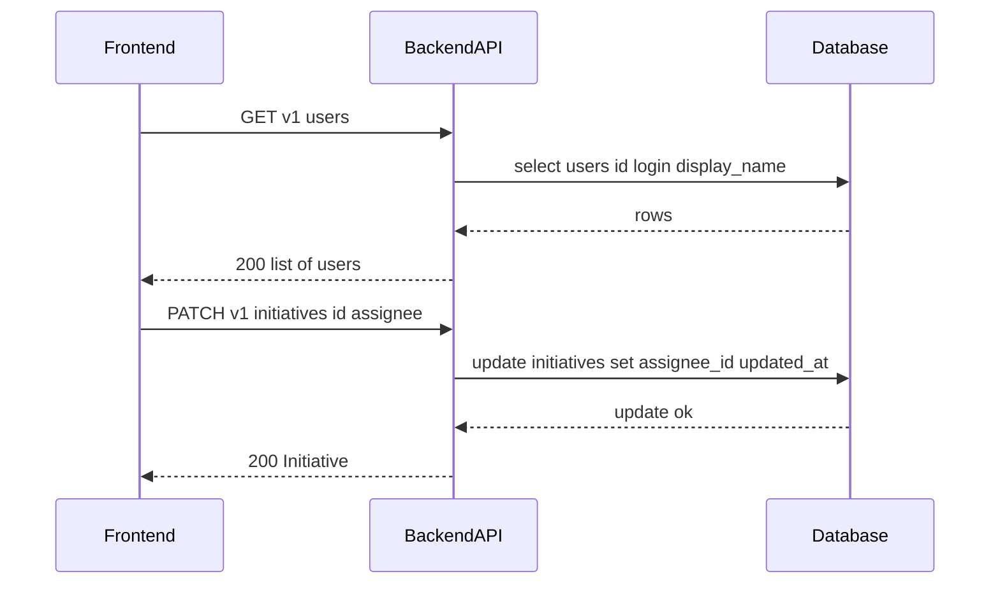

# TK-005 — Назначение ответственного

## Контекст и артефакты
FR: FR5 — назначение ответственного
PRD: docs/prd.md#fr5-назначение-ответственного
Architecture: docs/architecture.md#данные-и-модель
DBML: db/schema.dbml#initiatives
OpenAPI: docs/openapi.yaml#/paths/~1v1~1initiatives~1{id}~1assignee, docs/openapi.yaml#/paths/~1v1~1users
Deployment: docs/deployment.md#8-healthcheck-и-smoketest

## Область и границы
In:
- Назначение/снятие ответственного у инициативы через `PATCH /v1/initiatives/{id}/assignee`.
- Получение списка пользователей для выбора ответственного: `GET /v1/users` (id, login, displayName).
- UI выбора ответственного на карточке и в деталях инициативы, возможность очистить выбор (null).
Out:
- Аватары и расширенный профиль пользователя (используем инициалы из displayName).
- Поиск/подсказки по пользователям на сервере (при необходимости можно добавить параметр q позже).
- Любые роли/права — в MVP любой пользователь может назначать.
Dependencies:
- JWT‑аутентификация (TK-001) — все операции требуют Bearer токен.
- Список/фильтры (TK-006) используют поле assigneeId для фильтра «назначено на меня».

## Требования по слоям
### Backend
- `PATCH /v1/initiatives/{id}/assignee`:
  - RequestBody: `#/components/schemas/InitiativeAssigneeUpdate` (`assigneeId: uuid | null`).
  - Поведение: если `assigneeId = null` — снять назначение. Иначе проверить существование пользователя в `users`.
  - Побочный эффект: обновить `initiatives.assignee_id` и `updated_at = now()`. На поле `weight` влияние отсутствует.
  - Ответ: `200 Initiative` с актуальными данными.
  - Ошибки: `400` (невалидный JSON), `401`, `404` (инициатива не найдена), `422` (пользователь не найден или неверный формат UUID), `500`.
- `GET /v1/users` (для UI выбора):
  - Параметры запроса (опционально): `limit (1..100, default 20)`, `offset (>=0, default 0)`.
  - Ответ: `200` — массив `User[]` (только `id, login, displayName, createdAt, updatedAt`).
  - Без сортировки требований — по умолчанию `ORDER BY login ASC`.
  - Ошибки: `401`, `500`.
- Данные/миграции: новых полей не требуется. Используется `initiatives.assignee_id` (FK → `users.id`).

### Frontend
- Контрол «Ответственный» на карточке и в деталях инициативы:
  - Состояния: `loading` (загрузка списка пользователей), `empty` (нет пользователей), `error` (ошибка загрузки/сохранения), `success` (сохранено).
  - Взаимодействие: при открытии селекта — получить пользователей `GET /v1/users`; при выборе значения — отправить `PATCH /v1/initiatives/{id}/assignee`.
  - Возможность очистить выбор (установить `null`). Кнопка/элемент «Снять назначение».
  - Визуализация: инициалы из `displayName`, рядом — `login` (в скобках не писать, просто через пробел), текстовое имя отображать полностью.
  - После успеха обновить локальное состояние инициативы без полной перезагрузки страницы.

### DevOps
- Новых переменных окружения нет. Прокси/маршруты без изменений. Health‑чек без изменений.
- Логирование: на backend логировать изменение ответственного (info: initiativeId, assigneeId|null, actorId).

## Диаграмма последовательности

## Таблица взаимодействий
| Шаг | Источник | Получатель | Тип/Протокол | Ресурс/Эндпоинт | Запрос (схема) | Ответ (схема) | Атрибуты/валидации | Ошибки | Побочные эффекты |
|-----|----------|------------|--------------|-----------------|----------------|----------------|--------------------|--------|------------------|
| 1 | FE | API | HTTP GET | `/v1/users` | — (limit, offset) | `User[]` | limit 1..100; offset ≥0 | 401/500 | — |
| 2 | API | DB | SQL | `users` | — | — | `ORDER BY login ASC` | — | — |
| 3 | FE | API | HTTP PATCH | `/v1/initiatives/{id}/assignee` | `#/components/schemas/InitiativeAssigneeUpdate` | `#/components/schemas/Initiative` | assigneeId is uuid or null; user must exist | 400/401/404/422/500 | update assignee_id, updated_at |
| 4 | API | DB | SQL | `initiatives` | — | — | FK assignee_id → users.id | — | коммит |

## Алгоритмы и бизнес‑правила
- `assigneeId = null` снимает назначение (поле становится NULL).
- Если `assigneeId` передан и пользователя нет — вернуть `422 Error` с `details.assigneeId = "NOT_FOUND"`.
- `updated_at` всегда обновляется при успешном изменении `assignee_id`.

## Модель данных (срез)
- `db/schema.dbml#initiatives`: поле `assignee_id uuid [ref: > users.id, note: "Ответственный, опционально"]`.
- `db/schema.dbml#users`: используется для проверки существования пользователя.
- Ссылочная целостность: `Ref: initiatives.assignee_id > users.id [delete: set null]`.

## Контракты API (срез)
- `PATCH /v1/initiatives/{id}/assignee` → `InitiativeAssigneeUpdate` → `200 Initiative` (`docs/openapi.yaml#/paths/~1v1~1initiatives~1{id}~1assignee/patch`).
- `GET /v1/users` → `200 User[]` (`docs/openapi.yaml#/paths/~1v1~1users/get`).
- Общая безопасность: `bearerAuth`.

## Логи/health/конфигурация
- Backend: `info` при успешном изменении с полями `initiativeId`, `oldAssigneeId`, `newAssigneeId`, `actorId`.
- Health и конфигурация прокси без изменений.

## Критерии готовности (AC)
- text: "В OpenAPI описан PATCH /v1/initiatives/{id}/assignee (nullable UUID)"
  done: false
- text: "Добавлен GET /v1/users, ответ содержит массив User (id, login, displayName)"
  done: false
- text: "Поле assignee_id в initiatives ссылается на users; поведение null — снять назначение"
  done: false
- text: "Фронтенд поддерживает выбор и снятие ответственного на карточке и в деталях"
  done: false

## DoR спецификации
- [ ] Sequence и таблица согласованы
- [ ] OpenAPI 3.0.3: paths + schemas
- [ ] DBML: сущности/поля/ограничения
- [ ] UX‑состояния описаны
- [ ] Env/прокси указаны (если нужно)

