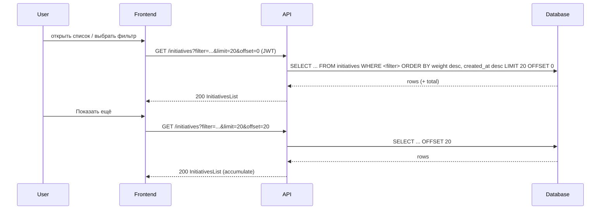

# TK-005 — Список инициатив: фильтры и сортировка по весу

## Контекст и артефакты
- **FR**: FR5 Список инициатив — фильтры и сортировка по весу (desc), затем по дате (desc)
- **PRD**: docs/prd.md#FR5.-Список-инициатив-фильтры-и-сортировка
- **Architecture**: docs/architecture.md#3.6-Список-инициатив-фильтр-и-сортировка
- **DBML**: db/schema.dbml#initiatives
- **OpenAPI**:
  - docs/openapi.yaml#/paths/~1initiatives/get
  - docs/openapi.yaml#/components/schemas/InitiativesList
  - docs/openapi.yaml#/components/securitySchemes/bearerAuth
- **Deployment**: docs/deployment.md#мониторинг-и-метрики

## Область и границы
- **In Scope**:
  - Получение списка инициатив с фильтрами `filter=all|mineCreated|assignedToMe` и пагинацией `limit/offset`.
  - Стабильная сортировка: сначала по `weight desc`, затем по `createdAt desc` (при равном весе — новые выше).
  - Возврат `items[]` по схеме `Initiative` + `total`, `limit`, `offset`.
  - Производительность: использование индексов, отсутствие N+1; подсчёт `commentsCount` без существенных накладных расходов.
  - Безопасность: доступ только при валидном JWT (`bearerAuth`).
- **Out of Scope**:
  - Обновление атрибутов `value/speed/cost` и пересчёт `weight` (TK-003).
  - Назначение/смена `assignee` (TK-006).
  - Комментарии (создание/список) как отдельные эндпоинты (TK-004).
- **Dependencies**:
  - Наличие пользователей и аутентификации (TK-001).
  - Наличие таблиц `initiatives`, `users`, `comments` и индексов из DBML (TK-002/TK-004).

## Требования по слоям

### Backend
- Эндпоинт: `GET /initiatives` (см. OpenAPI). Параметры запроса:
  - `filter: all|mineCreated|assignedToMe` (default: `all`). При неизвестном значении — использовать `all`.
  - `limit: integer [1..100]` (default: `20`).
  - `offset: integer [0..]` (default: `0`).
- Семантика фильтров:
  - `all`: все инициативы.
  - `mineCreated`: `author_id = currentUserId`.
  - `assignedToMe`: `assignee_id = currentUserId`.
- Сортировка: `ORDER BY weight DESC, created_at DESC`.
- Поля ответа: `InitiativesList` с `items[]` по схеме `Initiative` (включая `author`, `assignee`, `commentsCount`, `weight`) и полями пагинации `total`, `limit`, `offset`.
- Подсчёт `commentsCount`: агрегирование по `comments.initiative_id` (например, `LEFT JOIN ... GROUP BY` или `LATERAL` подзапрос) без N+1.
- Безопасность: требовать JWT (`bearerAuth`), при отсутствии/невалидности — `401`.
- Ошибки: единый формат `#/components/schemas/Error` для `401`. Невалидные параметры корректируются к default (без `400`) согласно текущему OpenAPI.
- Логи/наблюдаемость: логировать запросы списка (filter/limit/offset, userId, duration, count items), добавлять `correlationId`.
- Производительность и индексы (см. DBML):
  - Композитный индекс `(weight, created_at)`.
  - Индексы по `author_id`, `assignee_id`, `created_at`.
  - Исполнение запросов по фильтрам должно использовать соответствующие индексы.

### Frontend
- UI/Навигация:
  - Экран «Список инициатив» с табами: «Все», «Я предложил», «Назначено на меня».
  - Активный таб отражается в URL (например, `?filter=mineCreated`), при смене таба — сброс `offset` в `0` и перезагрузка списка.
- Пагинация:
  - Управление через `limit/offset`. Режим «Показать ещё» (кнопка) или бесконечный скролл; минимум — кнопка «Показать ещё».
  - `limit` по умолчанию 20; при мобильной ширине отображается ≥ 6 карточек при скролле без горизонтальной прокрутки.
- Состояния/UX:
  - `loading`: скелетоны карточек (не менее 6 при первой загрузке).
  - `empty`: текст «Создайте первую инициативу» при пустом результате.
  - `error`: toast + inline‑сообщение; кнопка «Повторить» перезагружает запрос.
  - Стабильная сортировка визуально соответствует `weight desc, createdAt desc`.
- Данные/контракты:
  - Использовать `GET /initiatives` по OpenAPI; отображать `title`, `author`, `assignee`, `weight`, `commentsCount`, `createdAt`.
  - При нажатии на карточку — переход на детальную страницу инициативы (`/initiatives/{id}`).

### DevOps
- Без дополнительных требований сверх существующих health/логов. В метриках полезно учитывать частоту запросов списка и длительность.

## Диаграмма последовательности — Список с фильтрами

## Таблица взаимодействий
| Шаг | Источник | Получатель | Тип/Протокол | Ресурс/Эндпоинт | Запрос (схема) | Ответ (схема) | Атрибуты/валидации | Ошибки | Побочные эффекты |
|-----|----------|------------|--------------|------------------|----------------|---------------|--------------------|--------|------------------|
| 1 | FE | API | HTTP GET | /initiatives | query: filter/limit/offset | `#/components/schemas/InitiativesList` | filter: enum; limit 1–100; offset ≥0 | 401 | — |
| 2 | API | DB | SQL | initiatives (+ users, comments) | — | — | WHERE по фильтру; ORDER BY weight desc, created_at desc | — | — |
| 3 | FE | API | HTTP GET | /initiatives (next page) | query: limit/offset | `#/components/schemas/InitiativesList` | offset увеличен | 401 | — |

## Модель данных (срез)
- `db/schema.dbml#initiatives`: поля id, title, description, author_id, assignee_id, value, speed, cost, weight, created_at, updated_at.
- Индексы: `(weight, created_at)`, `author_id`, `assignee_id`, `created_at`.
- `commentsCount` берётся из `comments` (агрегация по `initiative_id`).

## Контракты API (срез)
- GET /initiatives — `docs/openapi.yaml#/paths/~1initiatives/get`; ответ `InitiativesList`.
- Безопасность: `docs/openapi.yaml#/components/securitySchemes/bearerAuth`.

## Логи/health/конфигурация
- Логировать параметры списка и длительность; коррелировать по `correlationId`.
- Health/конфигурация — без изменений.

## Критерии готовности (AC)
- text: "GET /initiatives поддерживает filter=all|mineCreated|assignedToMe и пагинацию"
  done: false
- text: "Сортировка: weight desc, затем createdAt desc"
  done: false
- text: "Фронтенд — табы фильтров, стабильная сортировка, скелетоны"
  done: false
- text: "Индексы в БД под запросы списка"
  done: false

## DoR спецификации
- [x] Sequence и таблица согласованы
- [x] OpenAPI 3.0.3: paths + schemas ссылками
- [x] DBML: сущности/индексы согласованы
- [x] UX‑состояния описаны
- [x] Наблюдаемость/метрики отмечены

