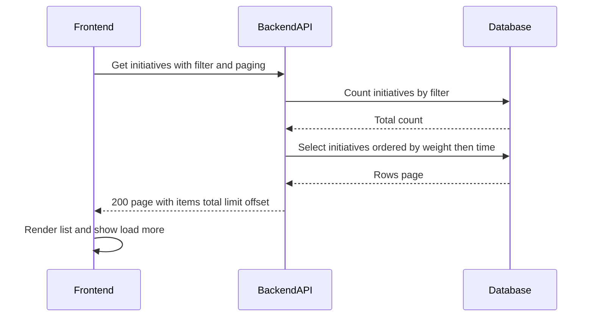

# TK-006 — Список инициатив: фильтры и сортировка

## Контекст и артефакты
FR: FR6 — список инициатив с фильтрами и сортировкой по весу
PRD: docs/prd.md#fr6-список-инициатив-фильтры-и-сортировка
Architecture: docs/architecture.md#список-инициатив-фильтры-и-сортировка
DBML: db/schema.dbml#initiatives
OpenAPI: docs/openapi.yaml#/paths/~1v1~1initiatives
Deployment: docs/deployment.md#8-healthcheck-и-smoketest

## Область и границы
In:
- Список инициатив по эндпоинту `GET /v1/initiatives` с параметрами `filter=all|authored|assigned`, `limit (1..100, default 20)`, `offset (>=0, default 0)`.
- Сортировка результатов: `ORDER BY weight DESC NULLS LAST, created_at DESC` на стороне БД.
- Возврат страницы результатов по схеме `InitiativePage` (items, total, limit, offset).
- UI переключения фильтров (табы) и базовая пагинация на клиенте.
Out:
- Полнотекстовый поиск, дополнительные фильтры (по названию/автору/датам) — вне объёма.
- Альтернативные сортировки (по дате, автору и т. п.) — не реализуются.
- Инкрементальная бесконечная прокрутка — опционально в будущем; в MVP — кнопка «Показать ещё».
Dependencies:
- TK-001 (JWT) — все запросы защищены Bearer токеном.
- TK-002 — наличие сущности инициативы и базовые поля отображения.
- TK-004 — вычисление и хранение `weight` при изменении атрибутов.
- TK-005 — поле `assigneeId` для фильтра «назначено на меня».

## Требования по слоям
### Backend
- Endpoint: `GET /v1/initiatives`.
  - Параметры:
    - `filter: string` — одно из `all|authored|assigned` (default `all`).
    - `limit: integer` — [1..100], default 20.
    - `offset: integer` — [0..], default 0.
  - Авторизация: `bearerAuth` (JWT). Текущий пользователь определяется по `sub`.
  - Фильтрация:
    - `all`: без условий по автору/ассайнменту.
    - `authored`: `author_id = currentUserId`.
    - `assigned`: `assignee_id = currentUserId`.
  - Сортировка: `ORDER BY weight DESC NULLS LAST, created_at DESC`.
  - Ответ: `200 InitiativePage` (`items[]`, `total`, `limit`, `offset`).
  - Ошибки: `401 Unauthorized`, `500 InternalServerError`.
  - Валидация параметров: выход за границы `limit/offset` → нормализация к ближайшему допустимому значению или 422 согласно общему стилю (на усмотрение реализации; рекомендуем нормализацию).
- Данные/индексы:
  - Используется таблица `initiatives`.
  - Для производительности сортировки и фильтров применяются индексы из DBML: `initiatives_weight_desc_idx` (weight), `initiatives_created_at_desc_idx` (created_at). Наличие индексов — обязательный критерий.
- Алгоритм ответа (SQL, упрощённо):
  1) `SELECT COUNT(*) FROM initiatives WHERE <filter-predicate>` → `total`.
  2) `SELECT <projection> FROM initiatives WHERE <filter-predicate> ORDER BY weight DESC NULLS LAST, created_at DESC LIMIT :limit OFFSET :offset` → `items`.

### Frontend
- Экран/вид списка инициатив:
  - Табы фильтров: «Все», «Я предложил», «Назначено на меня».
  - Пагинация: кнопка «Показать ещё» увеличивает `offset += limit` и дозагружает элементы; при смене вкладки сбрасывать `offset=0`.
  - Состояния: `loading` (скелетон или спиннер), `empty` (подсказка), `error` (toast/inline), `success` (список карточек).
  - Отображение веса: число с одним знаком или «—», элементы без веса — визуально внизу вследствие серверной сортировки.
  - Мобильный layout: одна колонка, без горизонтального скролла; карточки кликабельны на детали.

### DevOps
- Прокси/маршруты без изменений (`/api/* → backend`).
- Логирование на backend: `info` о запросах списка с полями `{filter, limit, offset, total, durationMs}`; `warn`/`error` для ошибок.
- Наблюдаемость: целевой p50/p95 latency на эндпоинте списка фиксируется в логах.

## Диаграмма последовательности

## Таблица взаимодействий
| Шаг | Источник | Получатель | Тип/Протокол | Ресурс/Эндпоинт | Запрос (схема) | Ответ (схема) | Атрибуты/валидации | Ошибки | Побочные эффекты |
|-----|----------|------------|--------------|-----------------|----------------|----------------|--------------------|--------|------------------|
| 1 | FE | API | HTTP GET | `/v1/initiatives` | query: filter, limit, offset | `#/components/schemas/InitiativePage` | filter∈{all,authored,assigned}; limit 1..100; offset≥0 | 401/500 | — |
| 2 | API | DB | SQL | `initiatives` | — | — | COUNT(*) по предикату фильтра | — | — |
| 3 | API | DB | SQL | `initiatives` | — | — | ORDER BY weight DESC NULLS LAST, created_at DESC; LIMIT/OFFSET | — | — |
| 4 | API | FE | HTTP 200 | — | — | `InitiativePage` | Совпадение limit/offset и размера items | — | — |

## Алгоритмы и бизнес‑правила
- Построение предиката фильтра:
  - `all`: `TRUE`.
  - `authored`: `author_id = currentUserId`.
  - `assigned`: `assignee_id = currentUserId`.
- Сортировка: всегда фиксированная — сначала `weight` по убыванию с `NULLS LAST`, затем `created_at` по убыванию.
- Параметры пагинации: при смене фильтра — сброс в начало (`offset=0`).
- Формат ошибок — общий `Error`.

## Модель данных (срез)
- `db/schema.dbml#initiatives` — используется существующая таблица.
- Индексы: `initiatives_weight_desc_idx` (по `weight`), `initiatives_created_at_desc_idx` (по `created_at`).

## Контракты API (срез)
- GET `/v1/initiatives` → `200 InitiativePage` (`docs/openapi.yaml#/paths/~1v1~1initiatives/get`).
- Параметры `filter`, `limit`, `offset` описаны в OpenAPI; безопасность `bearerAuth`.

## Логи/health/конфигурация
- Логи: `info` — `{filter, limit, offset, total, durationMs}`; `error` — с `code`, `message`, `correlationId`.
- Health и прокси — без изменений (см. `docs/deployment.md`).

## Критерии готовности (AC)
- text: "GET /v1/initiatives поддерживает filter=all|authored|assigned, limit, offset"
  done: false
- text: "Сортировка в БД: ORDER BY weight DESC NULLS LAST, created_at DESC; индексы существуют"
  done: false
- text: "Фронтенд реализует табы фильтров; элементы без веса — внизу"
  done: false
- text: "Мобильная раскладка отображает карточки без горизонтального скролла"
  done: false

## DoR спецификации
- [ ] Sequence и таблица согласованы
- [ ] OpenAPI 3.0.3: paths + schemas
- [ ] DBML: сущности/поля/ограничения
- [ ] UX‑состояния описаны
- [ ] Env/прокси указаны (если нужно)

