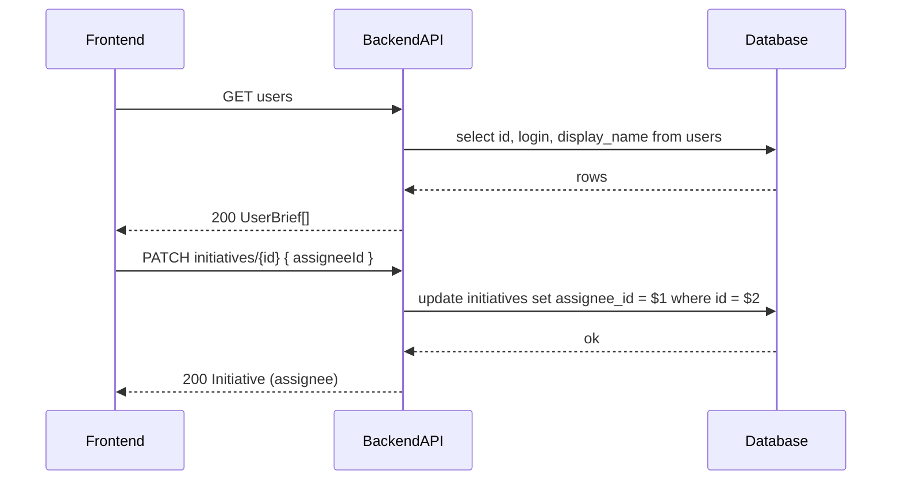

# TK-006 — Назначение ответственного

## Контекст и артефакты
- **FR**: FR4 Назначение ответственного — выбрать пользователя, отвечающего за инициативу; возможность снять назначение
- **PRD**: docs/prd.md#FR4.-Назначение-ответственного
- **Architecture**: docs/architecture.md#3.4-Назначение-ответственного
- **DBML**: db/schema.dbml#initiatives
- **OpenAPI**:
  - docs/openapi.yaml#/paths/~1initiatives~1{id}/patch
  - docs/openapi.yaml#/components/schemas/InitiativeUpdate (поле `assigneeId`)
  - docs/openapi.yaml#/components/schemas/Initiative (поле `assignee` как `UserBrief|null`)
  - docs/openapi.yaml#/paths/~1users (список для селекта ответственного)
- **Deployment**: docs/deployment.md#переменные-окружения (без изменений)

## Область и границы
- **In Scope**:
  - Возможность назначить ответственным любого пользователя из списка пользователей
  - Возможность снять назначение (установить `assigneeId = null`)
  - Синхронное обновление и возврат полной карточки инициативы с полем `assignee`
  - UX‑состояния: загрузка, ошибки, подтверждение успешного сохранения
- **Out of Scope**:
  - Управление списком пользователей/поиск по пользователям
  - Разграничение прав (все пользователи равноправны в демо)
  - Реалтайм обновления (допускается ручное обновление состояния после PATCH)
- **Dependencies**:
  - Наличие пользователей (TK-001)
  - Наличие сущности `initiative` и детального просмотра (TK-002)

## Требования по слоям

### Backend
- Эндпоинты (см. OpenAPI):
  - `PATCH /initiatives/{id}` → 200 `Initiative`. Принимает тело `InitiativeUpdate` c опциональным `assigneeId: uuid|null`.
  - `GET /users` → 200 `UserBrief[]` для заполнения селекта на фронтенде.
- Правила и ошибки:
  - Если `assigneeId` не существует в `users` → 400 `Error` (код `VALIDATION_ERROR`, details.assigneeId: "unknown user")
  - Если формат `id` не uuid → 400 `Error`
  - При отсутствии инициативы → 404 `NotFound`
  - Единый формат ошибок `#/components/schemas/Error`
- Данные:
  - Поле `initiatives.assignee_id` `uuid NULL` с FK на `users.id` (`ON DELETE SET NULL`)
  - Индекс `assignee_id` существует (см. DBML)
- Логи:
  - INFO: изменение ответственного (initiativeId, oldAssigneeId→newAssigneeId, actorId)
  - WARN: ошибки валидации/404; ERROR: исключения; корреляция по correlationId

### Frontend
- UX/Взаимодействие:
  - На карточке инициативы — селект с пользователями (`id`, `displayName`); пункт "Не назначено" для `null`
  - При выборе значения — отправка `PATCH /initiatives/{id}` c `{ assigneeId: <uuid|null> }`
  - После успеха — обновить локальное состояние карточки и показать toast "Сохранено"
- Состояния:
  - loading (при загрузке списка пользователей и при отправке PATCH)
  - error (toast + inline под селектом)
  - disabled селект при отсутствующей авторизации/во время запроса

### DevOps
- Без изменений сверх существующей конфигурации. Переменные окружения не добавляются.

## Диаграмма последовательности

## Таблица взаимодействий
| Шаг | Источник | Получатель | Тип/Протокол | Ресурс/Эндпоинт | Запрос (схема) | Ответ (схема) | Атрибуты/валидации | Ошибки | Побочные эффекты |
|-----|----------|------------|--------------|-----------------|----------------|---------------|--------------------|--------|------------------|
| 1 | FE | API | HTTP GET | /users | — | `UserBrief[]` | — | 401 | — |
| 2 | FE | API | HTTP PATCH | /initiatives/{id} | `#/components/schemas/InitiativeUpdate` | `#/components/schemas/Initiative` | assigneeId: uuid|null | 400/401/404 | update initiative |

## Алгоритмы и бизнес‑правила
- Назначение/снятие: любое изменение `assigneeId` допустимо, т.к. ролей/прав нет.
- При `assigneeId=null` на карточке отображать "Не назначено".
- При успешном обновлении возвращается полная сущность `Initiative` с `assignee` заполненным или `null`.

## Модель данных (срез)
- `db/schema.dbml#initiatives`: поле `assignee_id uuid NULL` (FK на `users.id`, `ON DELETE SET NULL`), индекс `assignee_id`.
- Соответствие API ↔ БД: `assigneeId` в запросе → `assignee` в ответе (`UserBrief|null`).

## Контракты API (срез)
- PATCH /initiatives/{id} — `docs/openapi.yaml#/paths/~1initiatives~1{id}/patch`; тело `InitiativeUpdate.assigneeId`; ответ `Initiative`.
- GET /users — `docs/openapi.yaml#/paths/~1users/get`; ответ `UserBrief[]`.

## UX‑состояния и ошибки
- Ошибки: неверный формат UUID, несуществующий пользователь, отсутствие прав (401).
- Отображение: inline‑ошибка под селектом, toast с текстом из `Error.message`.
- Доступность: размер тач‑таргетов ≥ 44 px; селект доступен с клавиатуры.

## Критерии готовности (AC) для TK-006
- [x] `PATCH /initiatives/{id}` поддерживает `assigneeId (uuid|null)` — реализовано и описано в OpenAPI
- [x] Фронтенд: селект пользователя, снятие назначения, UX‑состояния реализованы
- [x] OpenAPI/DBML синхронизированы по полю assignee/assigneeId
- [x] Ошибки и UX‑состояния покрыты (inline + toast); логи фиксируют смену

## DoR спецификации
- [x] Sequence и таблица согласованы
- [x] OpenAPI 3.0.3: ссылки на paths и schemas
- [x] DBML: поля и связи согласованы
- [x] UX‑состояния описаны
- [x] Env/прокси — без изменений
