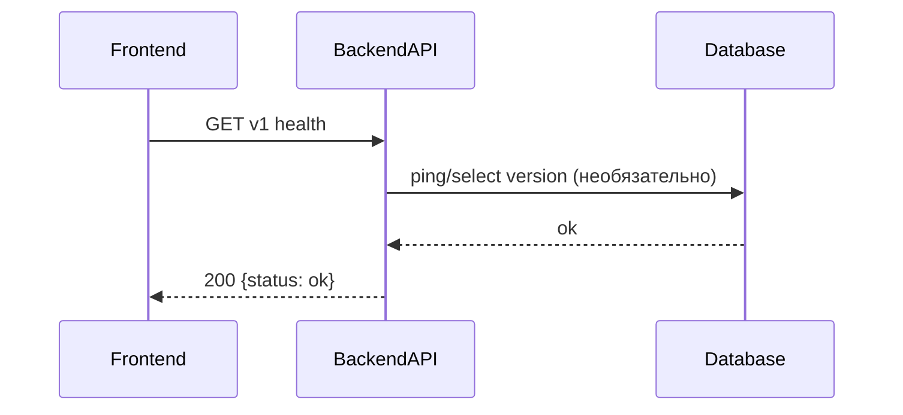

# TK-007 — Инфраструктура docker-compose + Caddy + .env

## Контекст и артефакты
FR: NFR — простота/надёжность; Health
PRD: docs/prd.md#7-нефункциональные-требования-простота-и-надёжность
Architecture: docs/architecture.md#наблюдаемость
DBML: db/schema.dbml
OpenAPI: docs/openapi.yaml#/paths/~1v1~1health
Deployment: docs/deployment.md

## Область и границы
In:
- Локальная и продовая конфигурация окружения через `.env` и `.env.example`.
- Docker Compose со службами `postgres`, `backend`, `frontend`, `caddy`.
- Caddy как обратный прокси: `/api/* → backend`, остальное — на `frontend`.
- Сборка образов на лету; применение миграций при старте backend через entrypoint.
- Health‑чек и smoketest: `/` и `/api/health` отдают 200.
Out:
- CI/CD пайплайн и авто‑деплой (вне текущего объёма).
- Мониторинг/метрики за пределами базовых логов и health.
Dependencies:
- Описанные переменные окружения и их использование в приложении (JWT, DB, порты).

## Требования по слоям
### Backend
- Поддержан endpoint `GET /v1/health` (без авторизации) — возвращает `{status:"ok"}`.
- Backend читает `DATABASE_URL`, `BACKEND_PORT`, `JWT_SECRET` из env.
- При старте backend выполняет миграции (golang-migrate), затем запускается на `:${BACKEND_PORT}`.

### Frontend
- Сборка статического бандла и отдача Caddy на `:${FRONTEND_PORT}`.
- Браузерный клиент обращается к API по `/api/*` (базовый путь `/api`).

### DevOps
- Файл `infra/docker-compose.yml` содержит 4 сервиса: `postgres`, `backend`, `frontend`, `caddy`.
- Файл `infra/caddy/Caddyfile` настраивает прокси маршруты с использованием env `APP_URL`, `BACKEND_PORT`, `FRONTEND_PORT`.
- `.env` (локально/прод) и `.env.example` (без секретов) описывают:
  - APP_URL, CADDY_EMAIL (опционально)
  - JWT_SECRET
  - POSTGRES_USER, POSTGRES_PASSWORD, POSTGRES_DB, POSTGRES_HOST, POSTGRES_PORT, DATABASE_URL
  - BACKEND_PORT, FRONTEND_PORT
- Сервис `backend` зависит от `postgres` по healthcheck; `caddy` зависит от `backend` и `frontend`.
- Порты наружу публикует только `caddy` (80/443 на проде; локально можно 80/443 или 8080/3000 внутренне через сеть).

## Диаграмма последовательности

## Таблица взаимодействий
| Шаг | Источник | Получатель | Тип/Протокол | Ресурс/Эндпоинт | Запрос (схема) | Ответ (схема) | Атрибуты/валидации | Ошибки | Побочные эффекты |
|-----|----------|------------|--------------|-----------------|----------------|----------------|--------------------|--------|------------------|
| 1 | FE | API | HTTP GET | `/v1/health` | — | `#/components/schemas/Health` | security: [] | 500 | — |

## Алгоритмы и бизнес‑правила
- При старте backend: ждать доступности БД, выполнить `migrate up`, затем запускать сервер.
- Прокси‑маршрутизация Caddy: `@api path /api/*` → `reverse_proxy backend:${BACKEND_PORT}`, иначе — `reverse_proxy frontend:${FRONTEND_PORT}`.

## Модель данных (срез)
- Используются существующие таблицы `users`, `initiatives`, `comments` (см. `db/schema.dbml`). Новых полей не требуется.

## Контракты API (срез)
- `GET /v1/health` → `200 Health` (`docs/openapi.yaml#/paths/~1v1~1health/get`).

## Логи/health/конфигурация
- Логи backend: старт, успешное применение миграций, ошибки подключения к БД.
- Health‑чек: `GET /v1/health` должен отвечать без аутентификации.
- Конфигурация Caddy хранится в `infra/caddy/Caddyfile`; использует env из `.env`.

## Критерии готовности (AC)
- text: "Существуют infra/docker-compose.yml и infra/caddy/Caddyfile; прокси /api/* → backend, остальное → frontend"
  done: false
- text: ".env.example добавлен; BACKEND_PORT, FRONTEND_PORT, DATABASE_URL, JWT_SECRET описаны"
  done: false
- text: "Образы собираются на лету; backend запускает миграции при старте через entrypoint"
  done: false
- text: "Smoketest проходит: / и /api/health возвращают 200"
  done: false

## DoR спецификации
- [ ] Sequence и таблица согласованы
- [ ] OpenAPI 3.0.3: paths + schemas (health)
- [ ] DBML: сущности/поля/ограничения согласованы
- [ ] UX‑состояния не применимы
- [ ] Env/прокси указаны
