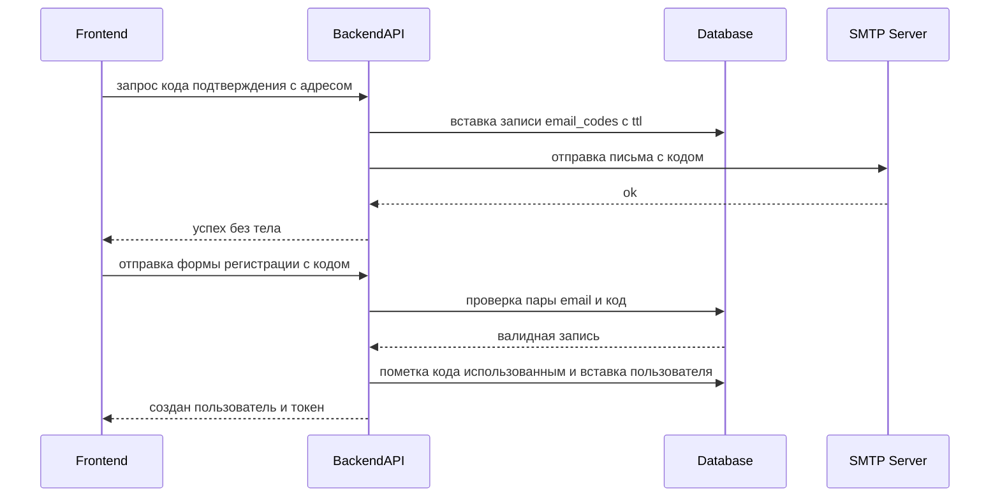

# TK-007 — V2 — Верификация e‑mail и доменное ограничение регистрации

## Контекст и артефакты
- FR: V2-EmailVerification — подтверждение e‑mail одноразовым кодом; V2-RegistrationDomain — ограничение регистрации корпоративным доменом.
- PRD: docs/prd.md#9.4-Регистрация-только-axenix.pro--подтверждение-e‑mail-кодом
- Architecture: docs/architecture.md#3.1-Регистрация-и-вход
- DBML: db/schema.dbml#email_codes, db/schema.dbml#users
- OpenAPI: 
  - docs/openapi.yaml#/paths/~1auth~1request-email-code
  - docs/openapi.yaml#/paths/~1auth~1register
  - docs/openapi.yaml#/components/schemas/EmailCodeRequest
  - docs/openapi.yaml#/components/schemas/UserRegister
  - docs/openapi.yaml#/components/schemas/AuthResponse
- Deployment: docs/deployment.md#переменные-окружения

## Область и границы
- In Scope:
  - Сервер: эндпоинт запроса кода подтверждения e‑mail и расширенная регистрация с полями `email`, `emailCode`.
  - Жёсткая проверка домена e‑mail согласно `AXENIX_EMAIL_DOMAIN` (по умолчанию `axenix.pro`).
  - Rate‑limit на запрос кода: не чаще 1 раза в минуту на адрес.
  - Генерация и хранение одноразовых кодов (TTL), пометка использования.
- Отправка письма через SMTP; логирование без утечки кода и секретов.
  - Обновление UX формы регистрации: поле e‑mail, кнопка «Получить код», поле ввода кода, обработка ошибок.
- Out of Scope:
  - Роли и права админов, логическое удаление инициатив, голосование (другие задачи V2).
  - Фоновая уборка просроченных кодов планировщиком (может быть реализована позже отдельной задачей).
- Зависимости: нет блокирующих; использует существующий контур JWT и регистрацию пользователя.

## Требования по слоям
### Backend
- Эндпоинты:
  - POST `/auth/request-email-code`
    - Тело: `EmailCodeRequest` (`#/components/schemas/EmailCodeRequest`).
    - Валидации: корректный формат e‑mail; домен совпадает с `AXENIX_EMAIL_DOMAIN` (без учёта регистра); нормализация e‑mail к нижнему регистру.
    - Поведение: сгенерировать 6‑значный цифровой код; записать в `email_codes` с `expires_at = now() + TTL`; сохранить `requested_ip` (если доступен); отправить письмо через Mailgun; вернуть 204.
    - Ограничения: rate‑limit 1 запрос в минуту на адрес (при превышении — 429 `TooManyRequests`).
    - Ошибки: 400 при невалидном e‑mail/домене; 429 при превышении частоты.
  - POST `/auth/register`
    - Тело: `UserRegister` (`#/components/schemas/UserRegister`), включает `email`, `emailCode`.
    - Валидации: логин/имя/пароль по существующим правилам; e‑mail домен; обязательный `emailCode` из валидного окна.
    - Проверки кода: пара `email` + `code` существует в `email_codes`, `expires_at > now()`, `used_at IS NULL`.
    - Поведение: пометить код как использованный (`used_at = now()`), создать пользователя, проставить `users.email_verified_at = now()`, вернуть `AuthResponse` 201.
    - Ошибки: 400 (валидация, неверный/просроченный код, домен не разрешён), 409 (пользователь уже существует).
- Бизнес‑правила:
  - Генерация кода: ровно 6 цифр, ведущие нули допускаются, хранить как строку `varchar(6)`.
  - TTL кода: `EMAIL_CODES_TTL_MINUTES` (по умолчанию 10 минут).
  - Идемпотентность запроса кода: при повторных запросах в пределах TTL разрешается выдача нового кода, но действует rate‑limit (1/мин на адрес).
  - Безопасность: в логах не писать сам код и секреты Mailgun; сообщения об ошибках без раскрытия внутренних деталей (единый `Error`).

### Frontend
- Экран входа/регистрации: вкладка регистрации дополняется полями `email`, `emailCode` и кнопкой «Получить код».
- Валидации на клиенте: базовая проверка формата e‑mail; блокировка кнопок во время запросов; понятные сообщения об ошибках.
- Взаимодействие с API:
  - Запрос кода: POST `/v1/auth/request-email-code` с `{ email }`; при 204 показывать уведомление о отправке.
  - Регистрация: POST `/v1/auth/register` с полями, включая `email`, `emailCode`; при успехе — логин с полученным токеном.

### DevOps
- Переменные окружения (.env):
  - `AXENIX_EMAIL_DOMAIN=axenix.pro`
  - `EMAIL_CODES_TTL_MINUTES=10`
  - `SMTP_HOST`, `SMTP_PORT`, `SMTP_USERNAME`, `SMTP_PASSWORD`, `SMTP_FROM`
  - `SMTP_TLS_SERVER_NAME` (если сертификат на другое имя), `SMTP_TLS_INSECURE_SKIP_VERIFY` (только для отладки)
- Прокси/роутинг: без изменений (действуют текущие правила `/api/*`).
- Логи/метрики: стандартные; добавить счётчики для 400/429 по эндпоинту запроса кода.

## Диаграмма последовательности

## Таблица взаимодействий
| Шаг | Источник | Получатель | Тип/Протокол | Ресурс/Эндпоинт | Запрос (схема) | Ответ (схема) | Атрибуты/валидации | Ошибки | Побочные эффекты |
|-----|----------|------------|--------------|-----------------|----------------|---------------|--------------------|--------|------------------|
| 1 | FE | API | HTTP POST | `/auth/request-email-code` | `#/components/schemas/EmailCodeRequest` | 204 No Content | e‑mail формат; домен = `AXENIX_EMAIL_DOMAIN`; rate‑limit 1/мин | 400, 429 | Вставка `email_codes`, отправка письма |
| 2 | API | DB | SQL | `email_codes` | — | — | индексы по `email`, `(email,code)`, `expires_at` | — | запись с `expires_at` |
| 3 | FE | API | HTTP POST | `/auth/register` | `#/components/schemas/UserRegister` | `#/components/schemas/AuthResponse` | обязательны `email`, `emailCode`; проверка пары и TTL | 400, 409 | создание пользователя; `used_at` и `email_verified_at` |

## Алгоритмы и бизнес‑правила
Запрос кода подтверждения:
1. Принять `email`; нормализовать в нижний регистр.
2. Проверить формат и домен по `AXENIX_EMAIL_DOMAIN`.
3. Проверить rate‑limit: если менее 60 секунд с момента предыдущей успешной выдачи кода на этот адрес — вернуть 429.
4. Сгенерировать случайный 6‑значный код.
5. Вставить запись в `email_codes` с `expires_at = now() + TTL`, `requested_ip` (если есть).
6. Отправить письмо через SMTP; при ошибке отправки — вернуть 400 с сообщением об ошибке.
7. Вернуть 204.

Регистрация с кодом:
1. Принять поля `UserRegister`, включая `email`, `emailCode`.
2. Проверить домен e‑mail.
3. Найти запись в `email_codes` по `email` и `code` с условиями `expires_at > now()`, `used_at IS NULL`.
4. Если не найдено — 400 (неверный или просроченный код).
5. Создать пользователя; проставить `email_verified_at = now()`.
6. Пометить код использованным `used_at = now()`.
7. Вернуть `AuthResponse` 201.

## Модель данных (срез)
- Таблица `email_codes` (db/schema.dbml#email_codes): `id`, `email`, `code`, `created_at`, `expires_at`, `used_at`, `requested_ip`; индексы: `(email, code)`, `email`, `expires_at`.
- Таблица `users` (db/schema.dbml#users): поле `email` уникально; `email_verified_at` помечается при успешной регистрации.

## Контракты API (срез)
- POST `/auth/request-email-code` → docs/openapi.yaml#/paths/~1auth~1request-email-code
- POST `/auth/register` → docs/openapi.yaml#/paths/~1auth~1register
- Схемы: `EmailCodeRequest`, `UserRegister`, `AuthResponse` в `#/components/schemas`.
- Единый формат ошибок: `#/components/schemas/Error`.

## Логи/health/конфигурация
- Логи: info для успешных операций (без кода и секретов), warn для 400, 409, 429, error для сбоев отправки письма; обязательный `correlationId`.
- Health: без изменений; базовый `/api/health`.
- Конфигурация: значения переменных окружения см. docs/deployment.md#переменные-окружения.

## Критерии готовности (AC)
- В спецификации есть диаграмма последовательности без слешей и скобок в названиях и сообщениях.
- Таблица взаимодействий согласована с диаграммой и OpenAPI.
- Ссылки на PRD 9.4, DBML `email_codes` и OpenAPI схемы присутствуют и актуальны.
- Перечислены переменные окружения для SMTP и доменного ограничения.
- Описаны валидации и негативные кейсы (неверный e‑mail, домен, код, rate‑limit).

## DoR спецификации
- [x] Sequence и таблица согласованы
- [x] OpenAPI 3.0.3: paths + schemas указаны
- [x] DBML: сущности/поля/индексы согласованы
- [x] UX‑состояния на фронтенде перечислены
- [x] Env/прокси указаны

