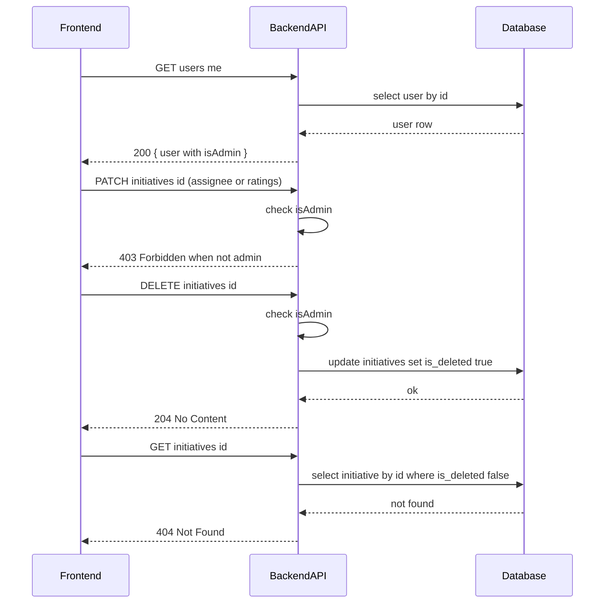

# TK-008 — V2: Роли админов и логическое удаление инициатив

## Контекст и артефакты
- FR из PRD: V2-Roles, V2-AdminDelete, V2-AdminUpdateFields
- PRD: docs/prd.md#9.1-Роли-и-разграничение-прав, docs/prd.md#9.3-Логическое-удаление-инициатив-только-админы
- Architecture: docs/architecture.md#6.-Безопасность (авторизация на сервере)
- DBML: db/schema.dbml#initiatives, db/schema.dbml#users
- OpenAPI: docs/openapi.yaml#/paths/~1users~1me, docs/openapi.yaml#/paths/~1initiatives~1{id}~1delete, docs/openapi.yaml#/paths/~1initiatives~1{id}~1patch
- Deployment: docs/deployment.md#переменные-окружения

## Область и границы
- In: серверная авторизация ролей админов по `ADMIN_EMAILS`; расширение `GET /users/me` полем `isAdmin`; ограничения на `PATCH /initiatives/{id}`; реализация логического удаления `DELETE /initiatives/{id}`; исключение удалённых инициатив из выборок (список/детали); изменения UI: read-only для не‑админов на админских полях, кнопка удаления для админов.
- Out: фактическая отправка e‑mail, голосование (в TK-009), любые физические удаления записей.
- Dependencies: TK-007 (e‑mail, переменные окружения добавляют `ADMIN_EMAILS` рядом), TK-002/003/005 (базовые сущности и списки уже реализованы).

## Требования по слоям
### Backend
- Роли: определить `isAdmin` на базе переменной окружения `ADMIN_EMAILS` (строка с e‑mail, разделённая запятыми, без пробелов). Сопоставление по `users.email` (точное, регистр‑инсенситив).
- GET `/users/me`: дополнить поле `isAdmin: boolean` (ссылка: `#/components/schemas/User` — `isAdmin`).
- PATCH `/initiatives/{id}`: изменения `assigneeId`, `value`, `speed`, `cost` разрешены только админам. Не‑админам возвращать 403 (`components/responses/Forbidden`). Обновление `title`/`description` доступно авторам (как сейчас) — в рамках этой задачи не меняется.
- DELETE `/initiatives/{id}`: логическое удаление — установка `initiatives.is_deleted = true`, `updated_at = now()`. Доступно только админам, иначе 403. Ответ 204.
- GET `/initiatives` и GET `/initiatives/{id}`: фильтровать записи с `is_deleted = true`. Для `/initiatives/{id}` — отдавать 404, если запись помечена как удалённая.
- Логи: фиксировать действия удаления и отклонённые попытки изменения админских полей (уровень info/ warn).

### Frontend
- Получать `isAdmin` из `/users/me` и кэшировать в состоянии аутентификации.
- На карточке инициативы: если `!isAdmin` — поля `value/speed/cost/assignee` отображаются read‑only; скрыть или дизэйблить контролы изменения.
- Для админа: показать кнопку "Удалить" с подтверждением. После успешного `DELETE` — редирект на список, показать уведомление.

### DevOps
- Новая переменная окружения: `ADMIN_EMAILS` (обязательная для V2). Описать формат и пример в `docs/deployment.md` и `.env.example`.
- Никаких новых прокси‑маршрутов; проверить наличие 401/403 в логах Caddy/сервиса.

## Диаграмма последовательности

## Таблица взаимодействий
| Шаг | Источник | Получатель | Тип/Протокол | Ресурс/Эндпоинт | Запрос (схема) | Ответ (схема) | Атрибуты/валидации | Ошибки | Побочные эффекты |
|-----|----------|------------|--------------|------------------|----------------|----------------|---------------------|--------|------------------|
| 1 | FE | API | HTTP GET | `/users/me` | — | `#/components/schemas/User` | добавлено поле `isAdmin` | 401 | — |
| 2 | FE | API | HTTP PATCH | `/initiatives/{id}` | `#/components/schemas/InitiativeUpdate` | `#/components/schemas/Initiative` | изменения admin‑полей только для админов | 401/403/404/400 | обновление инициativы |
| 3 | FE | API | HTTP DELETE | `/initiatives/{id}` | — | — (204) | только для админов | 401/403/404 | `is_deleted=true`, `updated_at=now()` |
| 4 | FE | API | HTTP GET | `/initiatives/{id}` | — | `#/components/schemas/Initiative` | выборка без удалённых | 401/404 | — |
| 5 | FE | API | HTTP GET | `/initiatives` | query | `#/components/schemas/InitiativesList` | фильтр по `is_deleted=false` | 401 | — |

## Алгоритмы и бизнес‑правила
- Определение роли админа:
  1) Прочитать `ADMIN_EMAILS` из окружения, разбить по запятой, нормализовать к нижнему регистру и обрезать пробелы.
  2) У текущего пользователя сравнить `user.email` в нижнем регистре с набором из шага 1.
  3) Вернуть `isAdmin = true`, если есть точное совпадение.
- Ограничение PATCH:
  - Если запрос содержит хотя бы одно из полей `assigneeId`, `value`, `speed`, `cost` и `!isAdmin` — вернуть 403.
- Логическое удаление:
  - Обновлять только если `is_deleted=false`; повторное удаление должно быть идемпотентным (возвращать 204).

## Модель данных (срез)
- Таблица `initiatives`: поле `is_deleted boolean default false` уже описано в DBML; индексы включают `is_deleted`.
- Таблица `users`: поле `email`, использование для определения админа. Изменений схемы не требуется.

## Контракты API (срез)
- GET `/users/me` → `#/components/schemas/User` (поле `isAdmin` присутствует).
- PATCH `/initiatives/{id}` → `#/components/schemas/InitiativeUpdate` (403 для не‑админов при изменении админских полей).
- DELETE `/initiatives/{id}` → 204; 403 для не‑админов.
- GET `/initiatives`, GET `/initiatives/{id}` — исключают записи с `is_deleted=true`.

## Логи/health/конфигурация
- Логи: id пользователя, действие, target initiative id, результат (успех/403), correlationId.
- Конфигурация: `ADMIN_EMAILS` (пример: `admin1@axenix.pro,admin2@axenix.pro`).

## Критерии готовности (AC)
- text: "Профиль пользователя (GET /users/me) содержит isAdmin, определяемый по ADMIN_EMAILS"
  done: false
- text: "PATCH /initiatives/{id}: поля assignee/value/speed/cost доступны только админу; non-admin получает 403"
  done: false
- text: "DELETE /initiatives/{id}: логическое удаление (is_deleted=true) доступно только админу"
  done: false
- text: "Удалённые инициативы отсутствуют в списках и по id отдают 404"
  done: false
- text: "Фронтенд: не‑админ видит поля в режиме чтения; админ видит кнопку 'Удалить'"
  done: false
- text: "ADMIN_EMAILS и связанные настройки берутся из .env; логи без утечки секретов"
  done: false

## DoR спецификации
- [x] Sequence и таблица согласованы
- [x] OpenAPI 3.0.3: paths + schemas ссылаются
- [x] DBML: сущности/поля/ограничения согласованы
- [x] UX‑состояния описаны
- [x] Env/прокси указаны

