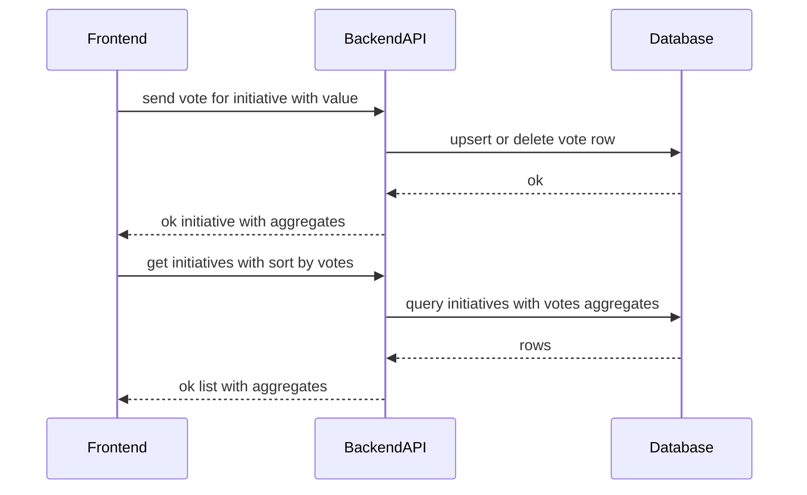

# TK-009 — V2: Голосование (up/down) и сортировка по голосам

## Контекст и артефакты
FR: V2‑Voting, V2‑SortByVotes (см. PRD 9.2)
PRD: docs/prd.md#9.2-Голосование-за-инициативы
Architecture: docs/architecture.md#агрегации-и-запросы
DBML: db/schema.dbml#initiative_votes, db/schema.dbml#initiatives
OpenAPI: docs/openapi.yaml#/paths/~1initiatives~1{id}~1vote, docs/openapi.yaml#/paths/~1initiatives, docs/openapi.yaml#/components/schemas/VoteRequest, docs/openapi.yaml#/components/schemas/Initiative
Deployment: docs/deployment.md#мониторинг-и-метрики

## Область и границы
In:
- Серверная логика голосования одного пользователя за одну инициативу: отдать голос вверх/вниз, сменить голос, снять голос.
- Расширение контрактов списка и карточки инициатив агрегатами: upVotes, downVotes, voteScore, currentUserVote.
- Сортировка списка по голосам: sort=votes с вторичной сортировкой по createdAt desc; исключение логически удалённых записей.
- Идемпотентность и корректность агрегатов при повторных запросах.

Out:
- Материализованные представления и фоновые задачи для агрегатов (возможны в будущем).
- Реалтайм‑обновления и вебсокеты (обновление по запросу/перезагрузке).
- Настройка специфичных индексов БД — выносится в TK-009/DV.

Dependencies:
- Наличие поля initiatives.is_deleted (см. TK-008) — использовать для фильтрации, даже если удаление ещё не реализовано.

## Требования по слоям
### Backend
- POST /initiatives/{id}/vote
  - Требует авторизации.
  - Тело: VoteRequest { value: -1 | 0 | 1 }, где 0 — снять голос.
  - Поведение:
    - value = 1 → upsert запись со значением 1 по ключу (initiative_id, user_id).
    - value = -1 → upsert запись со значением -1 по ключу (initiative_id, user_id).
    - value = 0 → удалить запись пользователя, если существует (idempotent no‑op, если нет).
  - Ответ 200: объект Initiative с обновлёнными полями upVotes, downVotes, voteScore, currentUserVote.
  - Ошибки: 400 (валидация value), 401 (нет JWT), 404 (инициатива отсутствует или is_deleted), 429 (при наличии rate limit в будущем).
- GET /initiatives
  - Новый параметр sort: weight | votes (по умолчанию weight). При votes сортировать по voteScore desc, затем createdAt desc.
  - Исключить initiatives.is_deleted = true из выборок.
  - В каждом элементе списка возвращать агрегаты upVotes/downVotes/voteScore и currentUserVote.
- Агрегаты (срез):
  - upVotes = COUNT(*) WHERE value = 1 по initiative_id.
  - downVotes = COUNT(*) WHERE value = -1 по initiative_id.
  - voteScore = upVotes − downVotes.
  - currentUserVote = COALESCE(v.value, 0) по текущему user_id.
- Производительность:
  - Использовать агрегирующий JOIN/CTE; избегать N+1 (агрегировать пакетно для списка).
  - DV подзадача может предложить дополнительные индексы для запросов по голосам и сортировки.

### Frontend
- Карточка инициативы и список отображают upVotes, downVotes, voteScore; подсветка выбранного пользователем голоса.
- Две кнопки голосования: Up/Down. Повторный клик по активной — снимает голос (value=0).
- Переключатель сортировки: «по весу» / «по голосам»; запоминание выбора в URL (query param sort).
- Состояния: loading (скелетоны), error (toast + inline), disabled-кнопки во время отправки голоса, optimistic обновление допустимо с откатом по ошибке.

### DevOps
- Логи событий голосования (уровень info): {initiativeId, userId, prevValue, newValue}.
- Метрики: счётчик успешных голосований и ошибок; длительность запроса голосования.
- Health без изменений; наблюдаемость — обычные запросные метрики.

## Диаграмма последовательности


## Таблица взаимодействий
| Шаг | Источник | Получатель | Тип/Протокол | Ресурс/Эндпоинт | Запрос (схема) | Ответ (схема) | Атрибуты/валидации | Ошибки | Побочные эффекты |
|-----|----|---|-----|-----|----|----|-----|-----|---|
| 1 | FE | API | HTTP POST | `/initiatives/{id}/vote` | `#/components/schemas/VoteRequest` | `#/components/schemas/Initiative` | value ∈ {-1,0,1}; id=uuid | 400/401/404/429 | insert/update/delete в `initiative_votes` |
| 2 | API | DB | SQL | `initiative_votes` | — | — | UNIQUE (initiative_id,user_id), CHECK value ∈ {-1,1} | — | upsert или delete |
| 3 | FE | API | HTTP GET | `/initiatives?sort=votes` | — | `#/components/schemas/InitiativesList` | вторичная сортировка по дате; exclude is_deleted | 401 | чтение агрегатов |

## Алгоритмы и бизнес‑правила
- Идемпотентность: повторный POST с тем же значением не изменяет состояние; value=0 всегда приводит к отсутствию записи пользователя.
- Псевдокод обработки голоса:
```
ensure value in {-1,0,1}
init = find_initiative(id)
if init == nil or init.is_deleted: return 404
if value == 0:
  delete from initiative_votes where initiative_id=id and user_id=me
else:
  upsert into initiative_votes (initiative_id, user_id, value)
    on conflict (initiative_id, user_id)
    do update set value = excluded.value, updated_at = now()
return initiative_with_aggregates(id, me)
```
- Агрегаты для карточки/списка вычисляются запросом; currentUserVote берётся из строки текущего пользователя (или 0).

## Модель данных (срез)
- `db/schema.dbml#initiative_votes`: ключ `(initiative_id, user_id)` уникален; `value smallint ∈ {-1,1}`; индексы по initiative_id и user_id.
- `db/schema.dbml#initiatives`: поле `is_deleted boolean default false` — исключать из выборок.

## Контракты API (срез)
- POST `docs/openapi.yaml#/paths/~1initiatives~1{id}~1vote` — `VoteRequest` → `Initiative`.
- GET `docs/openapi.yaml#/paths/~1initiatives` — параметры `filter`, `sort=weight|votes`, пагинация; возвращает `InitiativesList` с агрегатами.
- Схемы: `#/components/schemas/VoteRequest`, `#/components/schemas/Initiative` (поля upVotes, downVotes, voteScore, currentUserVote обязательны в ответах списка и карточки).

## Логи/health/конфигурация
- Логи: vote_change с полями {initiativeId, userId, prevValue, newValue, requestId}.
- Метрики: counter `api_vote_success_total`, `api_vote_error_total`; histogram `api_vote_duration_seconds`.
- Конфигурация окружения: без изменений.

## Критерии готовности (AC)
- text: "POST /initiatives/{id}/vote создаёт/меняет/снимает голос; возвращает обновлённую инициативу"
  done: false
- text: "GET /initiatives поддерживает sort=votes; вторичная сортировка по дате"
  done: false
- text: "Агрегаты upVotes/downVotes/voteScore и currentUserVote корректны; удалённые инициативы исключены"
  done: false
- text: "Фронтенд: кнопки up/down, индикация текущего голоса, переключатель сортировки"
  done: false

## DoR спецификации
- [x] Sequence и таблица согласованы
- [x] OpenAPI 3.0.3: paths + schemas указаны
- [x] DBML: сущности/поля/ограничения соответствуют
- [x] UX‑состояния описаны
- [x] Env/прокси не требуются

