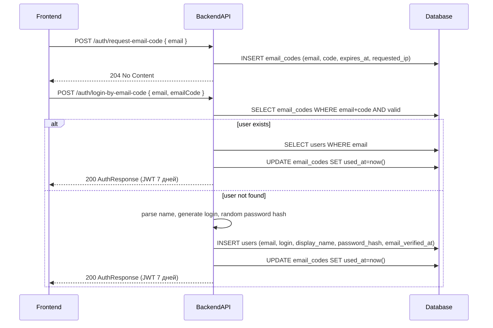

# TK-010 — V2 — Passwordless вход по e‑mail коду с авто‑регистрацией (Change Set)

## Контекст и артефакты
- PRD: `docs/prd.md#9.9-Упрощённый-вход/регистрация-по-e‑mail-коду-(passwordless)`
- Architecture: `docs/architecture.md#аутентификация-и-e-mail-верификация`
- DBML: `db/schema.dbml#email_codes`, `db/schema.dbml#users` (без изменений)
- OpenAPI:
  - `docs/openapi.yaml#/paths/~1auth~1login-by-email-code` (новый путь)
  - `docs/openapi.yaml#/paths/~1auth~1login` (помечен deprecated)
  - `docs/openapi.yaml#/components/securitySchemes/bearerAuth` (TTL 7 дней)
  - `docs/openapi.yaml#/components/schemas/EmailCodeLogin` (новая схема)
- Tasks: `tasks/tasks.yaml#TK-010`

## Change Set (изменения относительно текущей реализации)
1) PRD: добавлен раздел 9.9 — вход по одноразовому e‑mail коду; JWT сроком на 7 дней; авто‑создание пользователя при отсутствии; правила парсинга имени/фамилии из e‑mail. Поля логин/пароль на UI более не используются (в БД остаются).
2) OpenAPI:
   - Добавлен `POST /auth/login-by-email-code` с телом `EmailCodeLogin { email, emailCode }`, ответ `AuthResponse` 200.
   - `POST /auth/login` помечен `deprecated: true`.
   - Описание `bearerAuth` обновлено на «JWT токен со сроком жизни 7 дней», примеры `expiresAt` обновлены.
3) Backend (новый сценарий входа):
   - Новый эндпоинт `POST /auth/login-by-email-code`:
     - Валидации: `email` корректный и в домене `AXENIX_EMAIL_DOMAIN`; `emailCode` длина 6; нормализация e‑mail к нижнему регистру.
     - Проверка кода: пара `email`+`code` существует в `email_codes`, `expires_at > now()`, `used_at IS NULL`.
     - Если пользователь с `email` существует → выдать JWT (TTL 7 дней), пометить код использованным.
     - Если не существует → создать пользователя, затем выдать JWT и пометить код использованным:
       - `display_name`: по правилам парсинга имени/фамилии (см. ниже).
       - `login` (техническое поле для обратной совместимости):
         - базово: нормализованный local-part e‑mail (`[a-z0-9._-]`, прочие символы удаляются), усечение до 32;
         - при конфликте: добавить суффикс `-NNN` (0–999), перегенерировать до уникальности;
       - `password_hash`: сгенерировать случайный секрет и захешировать (как «заблокированный неизвестный пароль»), чтобы логин по паролю фактически был невозможен;
       - `email_verified_at = now()`.
   - JWT TTL увеличить до 7 дней (конфигурация сервера), не меняя формат токена.
4) Frontend (изменение UI):
   - Экран входа: поля `email`, `emailCode`, кнопка «Получить код», кнопка «Войти».
   - Взаимодействие: `POST /v1/auth/request-email-code` и `POST /v1/auth/login-by-email-code`; старый `login` скрыть/пометить как устаревший.
5) DBML: изменений схемы НЕТ. Используются уже существующие `users`, `email_codes`.

## Правила парсинга имени из e‑mail
- Брать часть до `@`, разбить по `.`.
- Если 2 части: первая — имя, вторая — фамилия.
- Если 3+ частей: первая — имя, последняя — фамилия; части между игнорируются.
- Если 1 часть: только имя; фамилия пустая.
- Капитализация: первая буква — заглавная, остальные — строчные (например, `dmitriy.petrakov` → `Dmitriy Petrakov`; `mikhail.a.smirnov` → `Mikhail Smirnov`).

## Диаграмма последовательности

## Таблица взаимодействий (срез)
| Шаг | Источник | Получатель | Тип/Протокол | Ресурс | Запрос (схема) | Ответ (схема) | Валидации | Ошибки | Побочные эффекты |
|-----|----------|------------|--------------|--------|----------------|---------------|-----------|--------|------------------|
| 1 | FE | API | HTTP POST | `/auth/request-email-code` | `EmailCodeRequest` | 204 | Формат e‑mail; домен; rate-limit 1/мин | 400, 429 | Запись `email_codes`, письмо |
| 2 | FE | API | HTTP POST | `/auth/login-by-email-code` | `EmailCodeLogin` | `AuthResponse` | Домен, код 6 знаков, нормализация | 400 | `used_at=now()`, при отсутствии юзера — `INSERT users` |

## Алгоритмы и бизнес‑правила
- Нормализация e‑mail: трим, lower-case, `mail.ParseAddress`.
- Проверка домена: `strings.HasSuffix(email, "@"+AXENIX_EMAIL_DOMAIN)`.
- Проверка кода: `expires_at > now()`, `used_at IS NULL`.
- Идемпотентность: повторный `login-by-email-code` с тем же валидным кодом недопустим (после успешного входа код помечается использованным).
- Генерация `login` (для совместимости): нормализованный local-part; при конфликте `-NNN`; длина ≤ 32.
- `password_hash`: безопасный хэш случайной строки; не использовать пустые/константные значения.
- JWT TTL: 7 дней.

## Контракты API (проверки соответствия)
- `docs/openapi.yaml` содержит:
  - `paths./auth/login-by-email-code.post` с `requestBody`→`EmailCodeLogin`, ответ 200→`AuthResponse`.
  - `paths./auth/login.post.deprecated: true`.
  - `components.securitySchemes.bearerAuth.description` содержит «7 дней».
  - Примеры `expiresAt` в `AuthResponse` и ответе `/auth/register` отражают 7 дней.
- Схемы: `EmailCodeLogin` добавлена.

## Модель данных (срез, без изменений)
- `users`: `login (unique, not null)`, `password_hash (not null)`, `email (unique, not null)`, `email_verified_at` — используются как прежде.
- `email_codes`: хранит пары `email`+`code` с `expires_at`, `used_at` и `requested_ip`.

## Логи/конфигурация
- Переменные окружения: `JWT_EXPIRATION=168h` (пример), `AXENIX_EMAIL_DOMAIN`, SMTP.
- Логи: не публиковать коды/секреты; 400 — неверный/просроченный код/домен, 429 — rate-limit.

## Критерии приёмки (AC)
1) Ввод корректного e‑mail домена и кода приводит к ответу 200 с JWT, `expiresAt` ≈ +7 дней от текущего времени.
2) При отсутствии пользователя происходит авто‑создание с корректным `displayName` по правилам парсинга и уникальным `login`.
3) Неверный/просроченный/повторно использованный код даёт 400; повторный запрос кода чаще 1/мин — 429.
4) В `docs/openapi.yaml` присутствует `POST /auth/login-by-email-code`; `POST /auth/login` помечен deprecated; TTL описан как 7 дней.
5) В БД изменений не требуется; новые записи пользователей создаются без нарушения ограничений (уникальный `email` и `login`, `password_hash` не пустой).

## DoR/DoD
- DoR: PRD 9.9 актуализирован; OpenAPI обновлён; подход к генерации `login` и `password_hash` описан; DB без изменений.
- DoD: Спецификация согласована с PRD и OpenAPI; проверки из раздела AC воспроизводимы; файл добавлен в репозиторий.
